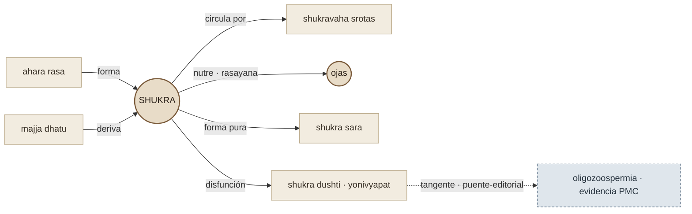

# Contornos: Ayurveda como fondo autónomo dentro de un GPS de analíticas

Versión 0.2 · 2026-07-11
Estado: documento metodológico / contrato de contornos
Cambios v0.2: adopta el encuadre de producto (GPS de analíticas, prioridad
estable) alineado con ARQUITECTURA §1.1/§3.6, e injerta la tabla figura/fondo por
consulta, los modos de retrieval y las métricas de salud del corpus; conserva las
fuentes, el mapeo al skill, el bloqueo honesto del grafo y el ejemplo real.

## 0. Qué resuelve este documento (y qué no es)

**VitaMap es un GPS de analíticas.** Su **figura por defecto es la biomedicina
medible**. Las tradiciones pueden aparecer como capas de **contexto, comparación o
exploración**, pero **no sustituyen ni reinterpretan automáticamente la lectura
clínica**. Ese encuadre de producto lo fija [ARQUITECTURA §1.1](ARQUITECTURA-CORPUS-TEMATICO-Y-RECUPERACION.md);
aquí se desarrolla el lado del **fondo** (Ayurveda) sin tocar esa prioridad.

VitaMap ya fija la relación entre biomedicina y tradiciones como una composición
de **figura y fondo** ([ADR-013](DECISIONS.md#adr-013--figura-fondo-y-procedencia-del-corpus-compartido),
[ARQUITECTURA §3.6](ARQUITECTURA-CORPUS-TEMATICO-Y-RECUPERACION.md)). Este texto
no reabre esa decisión: la **profundiza en un punto concreto** que el trabajo
reciente sobre las tarjetas Ayurveda (shukra, rasa, rakta) dejó al descubierto.

El punto es este: en un dibujo, figura y fondo *por momentos se funden y por
momentos la línea es cortante*. Pero el fondo **no es una sombra de la figura**.
Ayurveda no puede entrar al corpus solo como el eco tradicional de un biomarcador
—"shukra ≈ semen", "rakta ≈ sangre", "pitta ≈ bilis"—. Si lo hace, pierde lo
único que aporta: **un cuerpo y una continuidad propios**, una red de conceptos
que se sostiene sin depender de ninguna analítica.

Este documento es **investigación de contornos**, no un mapa de traducción. No
autoriza equivalencias nuevas. Establece *cómo* se le da cuerpo autónomo al
corpus Ayurveda y *dónde* la línea con la analítica debe ser cortante, difusa o
tangente. Se apoya en dos fuentes externas que trabajan exactamente esa frontera
(§3).

## 1. La tesis: prioridad estable, foco adaptable

La fórmula es **prioridad estable, foco adaptable** (ARQUITECTURA §1.1). No es una
jerarquía que se invierte: la **analítica conserva la prioridad estructural** del
producto; lo que se adapta es el **foco** de una consulta concreta. ADR-013 ya
dice que la intención de la pregunta decide qué carril ocupa el primer plano. De
ahí se sigue:

- **El foco figura/fondo es relativo a la pregunta; la prioridad no.** Una tarjeta
  Ayurveda es fondo ante una pregunta clínica y puede ganar **foco local** ante una
  pregunta sobre el propio marco —pero no reinterpreta ni sustituye la lectura
  clínica—. Por eso debe estar escrita para poder ocupar el primer plano cuando se
  la pide: legible desde sus propios términos, no como nota al pie de un análisis
  de sangre.
- **Autonomía no es aislamiento.** El corpus Ayurveda tiene que poder recorrerse
  entero por sus propias aristas internas (shukra ↔ ojas ↔ rasayana, rasa →
  rakta, dhatu → srotas) sin pasar nunca por un facet biomédico. Esa red interna
  es "el cuerpo". Los puntos de contacto con la analítica son tangencias
  ocasionales, no el esqueleto.
- **La línea cortante también es información.** Cuando un concepto no tiene
  contorno biomédico honesto, dejar el límite cortante —no abrir facets, no
  sugerir equivalencia— es una afirmación epistémica correcta, no una carencia.

Esto es lo que ya operacionaliza la herramienta editorial de generación de
tarjetas con sus tres salidas (`hub`, `relacion-interna`, `puente-editorial`) y
la regla figura-fondo para facets. Este documento le da el fundamento y las
fuentes.

### 1.1 Figura y fondo en el producto (por consulta)

La prominencia depende de la intención; la prioridad no desaparece.

| Consulta | Figura | Fondo |
|---|---|---|
| "¿Qué significa mi ferritina?" | Analítica | Tradición opcional o ausente |
| "¿Cómo se leen ferritina y PCR?" | Analítica relacional | Sin tradición salvo petición |
| "¿Qué es shukra?" | Ayurveda (foco local) | Analítica separada, solo si es pertinente |
| "Compárame ambas perspectivas" | Vista paralela | Ningún plano se fusiona |

Una tarjeta declara su plano y procedencia; la interfaz decide su prominencia. No
se almacena `figura: true` / `fondo: true` como propiedad permanente del contenido.

### 1.2 Modos de retrieval

- **Lectura clínica (por defecto):** prioriza memoria personal pertinente,
  interpretación, lectura conjunta, seguimiento, seguridad y evidencia moderna.
  Ayurveda **no** aparece por simple proximidad léxica.
- **Perspectiva tradicional (explícito):** prioriza conceptos internos, fuentes
  tradicionales, contexto histórico/filológico y relaciones internas; la evidencia
  moderna puede aparecer como bloque separado.
- **Comparación (explícito o inequívoco):** recupera ambos carriles por separado;
  **no** usa tangencias para transferir evidencia ni crear diagnósticos.

Son los tres modos de [ARQUITECTURA §10 Etapa E1](ARQUITECTURA-CORPUS-TEMATICO-Y-RECUPERACION.md).

## 2. Dos modos de tangencia (y uno de corte)

Antes de las fuentes, conviene nombrar los tres regímenes de contorno. Se mapean
1:1 con las salidas de la skill.

| Régimen | Qué es | Salida en la skill | Facets biomédicos |
|---|---|---|---|
| **Corte** | El concepto vive solo en el marco Ayurveda; no hay punto de contacto honesto | `hub` | Prohibidos |
| **Continuidad interna** | Relación entre conceptos Ayurveda (dhatu→srotas, rasa→dosha) | `relacion-interna` | Prohibidos |
| **Tangencia** | Hay un punto de contacto temático honesto con un biomarcador/área moderna | `puente-editorial` | Permitidos, con la separación de planos explícita |

La regla de oro, ya en la skill y confirmada por §3: **la traducción aproximada
no basta para abrir un contorno**. "Rakta" traducido como "sangre" no autoriza
`hematologico`; "shukra" cerca de "semen" no autoriza abrir facets de andrología.
El puente solo existe cuando una fuente sostiene la tangencia, no cuando el
diccionario la insinúa.

## 3. Fuentes de contorno

Las dos fuentes no se ingieren como tarjetas T3 (no responden una pregunta
clínica operacionalizable). Son **material metodológico**: muestran cómo otros
trabajan la frontera sin colapsarla.

### 3.1 Prakriti recapitulada por ML de fenotipos — la tangencia sin reducción

Tiwari P, Kutum R, Sethi T, et al. *Recapitulation of Ayurveda constitution types
by machine learning of phenotypic traits.* PLOS ONE, 2017.
DOI: [10.1371/journal.pone.0185380](https://doi.org/10.1371/journal.pone.0185380).

- **Qué hace.** Sobre 147 individuos de tres tipos extremos de *prakriti* (vata,
  pitta, kapha), aplica aprendizaje no supervisado y supervisado (LASSO, elastic
  net, random forests) a rasgos fenotípicos. El *clustering* no supervisado
  reproduce los tres tipos con ~93,9 % de acuerdo con las etiquetas de prakriti;
  la clasificación valida en una cohorte independiente.
- **Por qué importa para el contorno.** Es **validacionista, no reduccionista**.
  No colapsa prakriti en un sustrato genómico ni bioquímico: muestra que la
  clasificación ayurvédica tiene **estructura interna medible y consistente** —en
  sus palabras, "recapitula la conectividad entre sistemas aparentemente no
  relacionados que describe Ayurveda"—. La correlación con fenotipos es una
  **tangencia**, no una identidad.
- **Qué autoriza en el corpus.** Que un `puente-editorial` afirme un punto de
  contacto *empíricamente sostenido* (p. ej. prakriti ↔ perfil fenotípico)
  conservando el lenguaje propio y sin declarar equivalencia. Lo que **no**
  autoriza: convertir prakriti en un biomarcador, ni abrir facets clínicos en las
  tarjetas `hub`/`relacion-interna` que definen el concepto.
- **Lección de contorno.** La autonomía de Ayurveda no es antipositivista: un
  concepto tradicional puede tener cuerpo *y* rozar lo medible. El corte no es
  dogma; la tangencia se gana con evidencia.

### 3.2 Grafo de conocimiento sobre texto ayurvédico — el cuerpo propio

Terdalkar H, Bhattacharya A, Dubey M, Ramamurthy S, Naneria Singh B. *Semantic
Annotation and Querying Framework based on Semi-structured Ayurvedic Text.*
arXiv:[2202.00216](https://arxiv.org/abs/2202.00216) (2022; World Sanskrit
Conference, 2023).

- **Qué hace.** Construye un grafo de conocimiento del capítulo *Dhanyavarga* del
  *Bhāvaprakāśa Nighaṇṭu*: ~410 entidades y ~764 relaciones, con una **ontología
  propia** diseñada para capturar la semántica de los tipos de entidad y relación
  *del propio texto* (propiedades de sustancias, gunas, efectos), anotación
  manual sobre el marco Sangrahaka y 31 plantillas de consulta.
- **Por qué importa para el contorno.** Es la prueba de concepto de "el cuerpo
  propio": el conocimiento ayurvédico se modela **con las relaciones internas del
  texto**, no importando un esquema biomédico. El grafo se sostiene y se consulta
  sin equivalencias externas.
- **Qué valida en nuestra arquitectura.** Nuestro campo `relacionado_con` en las
  tarjetas y el grafo de la taxonomía ([[grafo-taxonomia-cableado]]) son
  exactamente ese mecanismo a escala VitaMap: aristas Ayurveda→Ayurveda que dan
  continuidad. La fuente confirma que ese es el camino correcto para la autonomía,
  y sugiere granularidad (entidad, relación tipada, plantillas de pregunta) hacia
  la que podemos crecer.
- **Lección de contorno.** El cuerpo autónomo se **construye**, no se declara. Sin
  aristas internas, una tarjeta Ayurveda es una isla que solo se alcanza desde su
  parecido con la analítica —justo la "sombra" que queremos evitar—.

## 4. El cuerpo propio, en concreto: el grafo interno

De 3.2 se sigue la consecuencia operativa más importante, y la que hoy falta.
Las tarjetas shukra/rasa/rakta describen sus conexiones internas en prosa
("Conexiones internas del marco ayurvedico") pero **no** las declaran como
aristas de grafo. Resultado: el marco existe en el texto pero no en el grafo; el
corpus Ayurveda no se puede recorrer por sí mismo. Es la diferencia entre tener
cuerpo y tener solo silueta.

### 4.1 Bloqueo conocido: el grafo es marker-a-marker (aplazado, 2026-07-10)

Al intentar el piloto (dibujar shukra ↔ ojas, shukra → shukravaha srotas) se
confirmó un límite del modelo de datos actual, no un descuido de las tarjetas:

- El grafo `relacionado_con` es **marker-a-marker**. El validador
  [test-marker-taxonomy.ts](../apps/web/scripts/test-marker-taxonomy.ts) exige que
  cada `relacionado_con.id` sea un **marcador canónico** (así funcionan
  ferritina→PCR, testosterona→SHBG: cada concepto es su propio marker y su propio
  nodo).
- Pero shukra, ojas, shukravaha srotas… **no son markers**: son **alias del único
  marker `ayurveda`**. Una arista "shukra ↔ ojas" a nivel de grafo colapsa a
  `ayurveda → ayurveda` —un bucle sin nodos que conectar—.
- **Un nodo del grafo = un marker.** Sin promover cada concepto Ayurveda a
  marcador canónico no hay nodos internos que unir, y el grafo autónomo del §3.2
  **no es expresable** mientras todo Ayurveda colapse a un marker.
- Dibujar aristas por `tarjeta_id` que ningún consumidor lee sería la "autonomía
  decorativa" contra la que advierte el §7, y rompería el validador en cuanto las
  tarjetas pasen a `approved-current-structure/`.

**Decisión (aplazar).** No se fuerzan aristas ahora. Motivos: (a) el grafo sigue
**dormido en retrieval** —`relacionado_con` aún no se consume; su uso vive en el
GPS y en una futura expansión a vecinos ([[grafo-taxonomia-cableado]])—, así que
dibujarlo hoy no rinde nada operativo; (b) promover conceptos a markers cambia el
scope de recuperación y contradice la regla de la skill "no inventes markers", que
habría que actualizar en el mismo movimiento; (c) coherente con "medir antes de
afinar" ([[direccion-metodologica]]).

**Condición de reapertura.** Retomar la promoción a markers cuando se cumpla lo
antes: el grafo entre de verdad en retrieval, **o** exista un banco de evaluación
Ayurveda que mida si las aristas mejoran la recuperación. Entonces la vía natural
es promover un conjunto mínimo de conceptos (shukra, ojas, …) a marcadores
canónicos bajo `dominio: tradiciones-practicas`, mover sus alias desde `ayurveda`,
y recién ahí dibujar shukra → ojas (`nutre_a`, `dirigida`), rasa → rakta
(`se_transforma_en`), dhatu → srotas (`circula_por`). El plan priorizado de esa
promoción (nodos, aristas tipadas con `layer`, y el orden medido) vive en
[PRIORIDADES-ESTRUCTURA-RAG-FIGURA-FONDO.md](PRIORIDADES-ESTRUCTURA-RAG-FIGURA-FONDO.md).

### 4.2 Regla permanente

Cuando el grafo interno se construya, una arista `relacionado_con` es **continuidad
interna** → nunca es un puente biomédico. Los puentes con la analítica van como
`puente-editorial` con facets (§2), no como aristas del grafo Ayurveda.

### 4.3 Boceto del mapa (clúster shukra)

Cómo se vería el grafo interno una vez construido. Líneas sólidas = continuidad
interna (líneas firmes del contorno); línea punteada = la única tangencia con la
analítica, hoy sin dibujar y con la pregunta clínica sin abrir. Es un boceto
conceptual, no la pantalla final conectada a los datos.

Visual principal (mapa interactivo: dos planos, aristas internas + tangencias,
modos por intención): [docs/visuales/vitamap_mapa_conocimiento_figura_fondo.html](visuales/vitamap_mapa_conocimiento_figura_fondo.html)
— publicado en https://claude.ai/code/artifact/7f75deaa-7d71-4fad-88de-fb4b07666b92
(prototipo semilla; datos ilustrativos, no leídos de `corpus-taxonomy.json`).
Catálogo de todos los visuales en [docs/vision/visuales/INDEX.md](visuales/INDEX.md). Existe
además una versión estática mínima superada
([mapa-figura-fondo.html](visuales/mapa-figura-fondo.html)).

## 5. Reglas de contorno (contrato de redacción)

Resumen accionable para quien redacta o revisa tarjetas Ayurveda.

1. **Toda tarjeta `hub`/`relacion-interna` debe poder ser figura.** Se lee entera
   desde el marco Ayurveda, sin que un facet clínico sea necesario para
   entenderla.
2. **La línea cortante por defecto.** Ante la duda, no se abre facet. El corte es
   la posición segura; la tangencia se justifica con fuente.
3. **Tangencia solo con evidencia de tangencia** (modelo §3.1): un
   `puente-editorial` nombra el punto de contacto, cita la fuente que lo sostiene
   y abre el primer párrafo separando planos ("la biomedicina mide X; Ayurveda
   organiza el terreno desde Y, sin equivalencia directa").
4. **El cuerpo se declara, no se insinúa** (modelo §3.2): las conexiones internas
   van como `relacionado_con`, además de la prosa.
5. **Sin disfraz y sin refutación ritual** (ADR-013): la tradición no se viste de
   ciencia ni recibe un desmentido clínico automático cuando la pregunta no es
   clínica.

## 6. Ejemplo vivo: shukra

El paquete shukra (2026-07-10) ilustra los tres regímenes:

- **Corte** — `shukra-definicion-dos-formas`, `shukra-cualidades-shukra-sara`,
  `shukra-cantidad-tiempo-formacion`: `hub`, sin facets. Correcto: definen el
  concepto en su marco.
- **Continuidad interna** — `shukra-formacion-metabolismo-circulacion`
  (shukra ↔ shukravaha srotas ↔ majja), `shukra-ojas-relacion-atraves-rasayana`
  (shukra ↔ ojas vía rasayana): `relacion-interna`. Hoy en prosa; candidatas
  naturales a `relacionado_con` (§4).
- **Tangencia potencial** — la evidencia moderna en oligozoospermia que menciona
  "Shukra dhatu" (PMC6891991, en SOURCES) sería la base de un futuro
  `puente-editorial` T3 *si* se operacionaliza una pregunta clínica; hoy,
  correctamente, se deja como pista y la línea queda cortante.

Que las tarjetas de corte **no** hayan abierto facets biomédicos (a diferencia de
rasa/rakta del prompt anterior, que sí abrieron `sistema`/`area_de_salud`) es la
señal de que la regla de contorno ya está operando bien en el generador.

## 7. Límites y riesgos

- **No es una licencia para multiplicar puentes.** §3.1 es un permiso estrecho:
  una tangencia con evidencia, no una invitación a correlacionar todo.
- **El grafo interno puede volverse ruido** si se declaran aristas débiles. Cada
  `relacionado_con` debe corresponder a una relación que la fuente sostenga, con
  su `direccion` y, si aplica, `contexto`.
- **Riesgo de autonomía decorativa.** Si el corpus Ayurveda crece en tarjetas pero
  no en aristas, tendremos "cuerpo" nominal sin continuidad real.

**Métricas de salud del corpus Ayurveda** (no usar la densidad bruta de aristas
como objetivo): cobertura de conceptos nucleares · % de aristas con procedencia ·
% revisado · nodos huérfanos · preguntas internas respondibles · precisión de
recorridos · fugas biomédicas no solicitadas · tangencias sin límites explícitos.

## 8. Referencias

- Tiwari P, Kutum R, Sethi T, et al. *Recapitulation of Ayurveda constitution
  types by machine learning of phenotypic traits.* PLOS ONE, 2017.
  https://doi.org/10.1371/journal.pone.0185380
- Terdalkar H, Bhattacharya A, Dubey M, Ramamurthy S, Naneria Singh B. *Semantic
  Annotation and Querying Framework based on Semi-structured Ayurvedic Text.*
  arXiv:2202.00216, 2022. https://arxiv.org/abs/2202.00216
- Interno: [ADR-013](DECISIONS.md), [ARQUITECTURA-CORPUS §3.6](ARQUITECTURA-CORPUS-TEMATICO-Y-RECUPERACION.md),
  [DIRECCION-METODOLOGICA-EVIDENCIA-Y-GRAFO](DIRECCION-METODOLOGICA-EVIDENCIA-Y-GRAFO.md).
