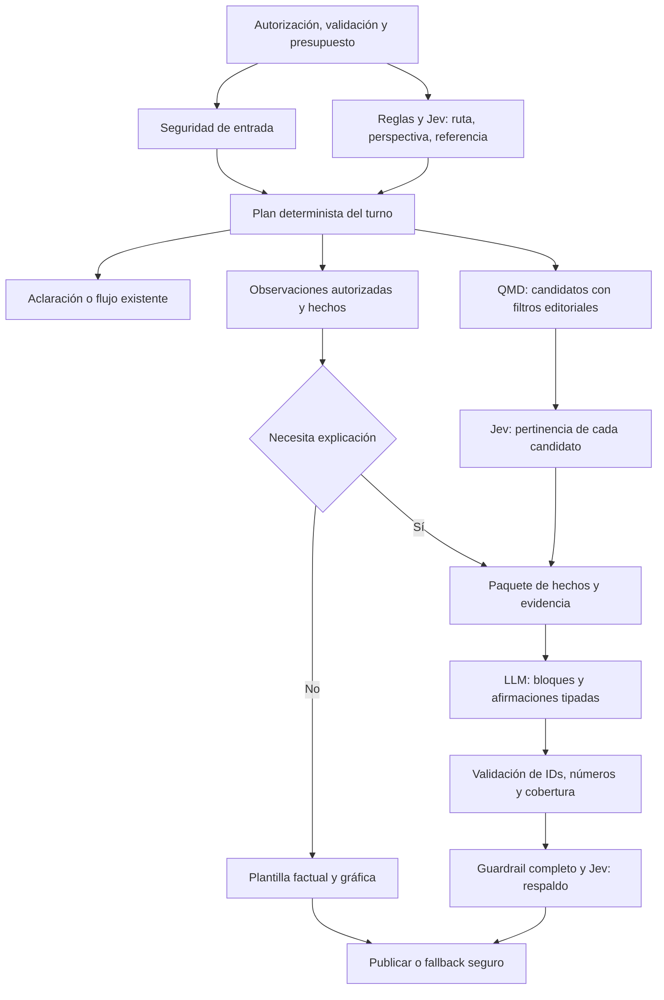

# Variante Jev: decisiones acotadas y respuestas fundamentadas

2026-09-20 · Actualizado 2026-09-21. **Laboratorio sintético Jev implementado;
pendiente de despliegue, prueba con credenciales y evaluación real.**
Desarrolla la [propuesta de orquestación](PROPUESTA-ORQUESTACION-CONVERSACIONAL.md),
especialmente E1–E4. Su objetivo es reducir las oportunidades de inventar datos,
fuentes y acciones; el ahorro de llamadas es una consecuencia a medir por ruta.

Estado vigente: §11. Las entregas de §6 describen el recorrido completo hacia el
chat real; el laboratorio permite evaluar componentes con fuentes fijas, sin
dar por completada la integración con recuperación QMD ni habilitar datos reales.

## 1. Alcance de la primera versión

Un único flujo vertical del chat, en español y alemán, con tres usos de Jev:

1. **Decidir la ruta y perspectiva** entre opciones que VitaMap define.
2. **Evaluar pertinencia de fragmentos existentes** recuperados por QMD.
3. **Evaluar respaldo de afirmaciones** frente a fuentes concretas, inicialmente
   en evaluación offline y después como veto adicional, nunca como permiso único.

La primera versión cubre consulta factual de analíticas, explicación educativa
y aclaraciones de seguimiento. Conserva las rutas existentes de reflexión y
acciones bajo sus controles; Jev puede reconocerlas, pero no implementa herramientas
nuevas. Usa el corpus y las series ya disponibles. No incluye migración de datos,
LOINC/FHIR, nuevos cálculos clínicos, memoria automática, streaming, entrenamiento
de modelos ni sustitución del detector de crisis.

**Criterio de rigor:** hechos y permisos determinados por código; decisiones
semánticas delimitadas y evaluadas; texto libre solo donde aporta explicación.
No presentar el conjunto como «sin alucinaciones».

El fabricante atribuye su garantía de cero alucinaciones al cumplimiento del
esquema. Esto impide inventar una opción fuera de las ofrecidas, pero no prueba que
la opción elegida sea correcta. La [explicación original](https://typesafe.ai/blog/introducing-system-one-models-and-jev)
permite distinguir la garantía estructural del acierto semántico.

## 2. Reparto de responsabilidades

| Componente | Responsabilidad | Límite |
|---|---|---|
| `requireChatContext` y guardas | Actor, sujeto, demo y permisos | Ningún resultado de Jev cambia la identidad o el ámbito autorizado |
| `crisis.ts` | Seguridad de entrada, con correcciones de cobertura/error ya propuestas | Jev no la sustituye en este experimento |
| Jev / evaluación del turno | Intención, perspectiva y dependencia contextual | No escribe, no abre archivos, no crea queries SQL ni funciones |
| Política de turno | Convertir decisiones y permisos en un plan cerrado | Ambigüedad conduce a aclaración, no a más acceso |
| `memory-reader` + `lab-facts` | Seleccionar observaciones y producir hechos | Sin interpretación diagnóstica ni conversiones no validadas |
| QMD + política editorial | Recuperar candidatos existentes | Mantener límites de marcador, idioma, perspectiva y procedencia |
| Jev / pertinencia | Valorar cada candidato contra una pregunta delimitada | No buscar ni completar lo que no se recuperó |
| Renderizador factual | Mostrar cifras, fechas, unidades, intervalos y fuentes | Plantillas revisadas; no paráfrasis generativa de magnitudes |
| LLM actual | Redactar explicación estructurada desde el paquete autorizado | No decidir herramientas ni modificar hechos |
| Validadores + guardrail + Jev experimental | Revisar contrato, respaldo y límites de la respuesta | Jev puede vetar; un resultado favorable no anula otro bloqueo |

No requiere un servicio adicional propio ni una base de datos nueva. El adaptador
Jev vive en el backend Node/TypeScript de Next.js y usa HTTP; las credenciales nunca
se exponen al navegador. Las distribuciones se usan internamente y no se muestran
como «porcentaje de certeza médica».

## 3. Recorrido técnico de un turno



### 3.1 J1: entender qué se pide

Primero consolidar reglas existentes (`conversation-policy`, `marker-scope`,
`personal-context-policy`). No pagar Jev por una selección ya inequívoca en la UI
o por una regla de alta precisión validada. En texto ambiguo, una petición J1
formula tres preguntas Choice sobre el mismo estado mínimo:

- `intent`: `knowledge`, `personal_facts`, `personal_explanation`, `reflection`,
  `action`, `smalltalk`, `mixed`, `unclear`.
- `perspective`: `biomedical`, `traditional`, `comparison`, `unspecified`.
- `reference`: `self_contained`, `previous_offer`, `previous_topic`, `ambiguous`.

Cada pregunta tiene instrucciones y criterios propios. La clave de pregunta no
sustituye esas instrucciones. El estado contiene mensaje y contexto conversacional
acotado, sin cargar todavía documentos o series personales. El mensaje libre puede
contener datos sensibles: estado mínimo no significa estado anónimo.

El servidor valida resultados y resuelve referencias. Si hay dos temas posibles,
Jev no inventa un marcador; el sistema pregunta cuál. Para elegir entre referentes
concretos en una evolución, ofrecer exclusivamente sus IDs más `none/unclear`.
La ruta se decide en código; por ejemplo, `knowledge` no abre el store personal.

La seguridad de entrada corre también cuando la regla o Jev clasifica un saludo.
Puede evaluarse en paralelo a J1 porque no depende de su resultado. No iniciar
lecturas personales ni generación hasta que ambas etapas permitan continuar.

### 3.2 Preparar hechos y candidatos

Para «muéstrame mi última ferritina», código determinista selecciona el último
resultado autorizado de ese marcador, preserva su unidad y produce la tarjeta y
la gráfica. No necesita QMD público, J2, generación o J3. El presupuesto incluye
seguridad de entrada y, si hizo falta, J1.

Para «explícame qué significa», resolver el referente, obtener hechos y consultar
QMD. Reutilizar los filtros de la búsqueda actual; extraerlos a una función común
antes de crear una ruta solo KB, porque `queryKB` no reproduce hoy todos los filtros
de `queryMemoryAndKB`.

Propuesta inicial: como máximo **6 candidatos**, con hasta 3 fragmentos finales;
presupuesto ajustable solo tras evaluación. Preservar pasajes coherentes, cautelas
y procedencia. Si no caben completos dentro del presupuesto, marcar insuficiencia
u omitir el candidato; no truncar una negación y tratar el resultado como evidencia.
No reindexar QMD ni cambiar sus embeddings en este experimento.

### 3.3 J2: pertinencia sin inventar fuentes

Asignar IDs efímeros `s1`…`s6` a los candidatos. Para cada uno, preguntar mediante
Choice si es `direct`, `context_only`, `irrelevant` o `insufficient`. Todas las
preguntas pueden ir en una petición, pero cada instrucción identifica su fragmento
y la consulta a evaluar; no presupone conocer la respuesta de otra pregunta.

`direct` significa que el pasaje ayuda a responder la pregunta concreta dentro de
su marco; no certifica verdad clínica. `insufficient` incluye pasaje incompleto o
información que no permite decidir. La política del servidor conserva primero los
candidatos directos aceptados y añade contexto si el presupuesto lo permite.

Una selección vacía es un resultado válido: decir que falta evidencia o aclarar;
no elegir siempre el mejor de un conjunto inadecuado. No descartar cautelas o
contradicciones pertinentes solo porque hagan la respuesta menos fluida. Incluir
estos casos en el banco de pruebas y conservar metadatos de limitaciones.

El score de Jev no cambia `sourceKind`, revisión editorial, idioma o nivel de evidencia.
Una fuente tradicional sigue siéndolo aunque resulte muy pertinente. Las reglas
deterministas de perspectiva y seguridad se aplican antes y después de seleccionar.

**Por qué no pedirle que redacte la fuente:** el código entrega al generador el
fragmento original identificado. Jev devuelve únicamente una categoría permitida;
no existe un campo donde fabricar una referencia, URL o resumen.

### 3.4 Generación mínima y contrato de afirmaciones

Para las consultas factuales usar las plantillas de `lab-chat-fallback`, revisadas
para identidad de informe, empates, valores censurados y comparabilidad. Jev no
escoge números ni decide qué resultado es cronológicamente el último.

Para explicaciones, mantener `chat()` y `jsonSchema` del cliente existente, con un
contrato más estricto. Boceto interno; aún no es API implementada:

```ts
type Statement = {
  id: string;
  kind: 'explanation' | 'reflection' | 'question' | 'caution';
  text: string;           // Una afirmación o unidad breve por elemento.
  sourceIds: string[];    // IDs asignados por el servidor en este turno.
  factIds: string[];
};
type Draft = { statements: Statement[] }; // Máximo inicial: 6.
```

Los bloques con cifras personales los renderiza el servidor desde `factIds`, fuera
del texto libre. El generador recibe solo los hechos necesarios para contextualizar,
con la instrucción de no repetir ni reinterpretar magnitudes. Si incumple, el
validador rechaza la salida; no confiar solo en regex para garantizar significado.

Cada afirmación factual debe señalar su soporte; preguntas/reflexiones no necesitan
fuentes ficticias. La categoría declarada por el generador no lo exime de revisión.
El texto publicado se construye exclusivamente desde los elementos revisados y
los bloques deterministas. No admitir un campo `answer` libre fuera del contrato:
una lista separada de claims podría ocultar afirmaciones presentes solo en la prosa.

### 3.5 J3: respaldo acotado y revisión completa

Por cada afirmación, Jev recibe su texto y únicamente los pasajes citados, con una
pregunta Choice: `supported`, `contradicted`, `insufficient`. Puede evaluar hasta
6 afirmaciones en una petición; las instrucciones apuntan a los pares concretos
para evitar usar otra fuente del estado como respaldo de una cita incorrecta.

Esto comprueba una **relación textual**, no la verdad universal ni la corrección
del dato original. Un documento mal extraído o una tarjeta editorial incorrecta
no se corrigen por pasar J3. Cuando una frase une varias afirmaciones, todas deben
estar respaldadas; la ausencia de soporte de una parte conduce a `insufficient`.

Al mismo tiempo, `checkResponse` revisa la respuesta completa y su contexto:
diagnóstico, tratamiento, seguridad y mezcla de planos requieren visión de conjunto.
La aceptación se combina en código, sin promediar riesgos:

```text
publicar = contrato válido
        Y hechos autorizados y fieles
        Y revisión completa segura
        Y respaldo aceptado para todas las afirmaciones que lo requieren
```

En el primer ensayo J3 solo se mide offline. Tras superar sus pruebas puede vetar
salidas, pero nunca levantar un bloqueo del guardrail. Si discrepan, fallback o
revisión fuera del turno. No retirar la revisión actual hasta un estudio separado.

Primera versión sin reparación generativa: ante fallo, renderizar hechos seguros
con un aviso de que no se pudo fundamentar la explicación; para conocimiento sin
hechos, respuesta localizada de insuficiencia. No suprimir frases a ciegas y publicar
el resto: podría eliminar una cautela necesaria. Una reparación futura consumiría
presupuesto y repetiría todas las revisiones.

## 4. Adaptador y política de incertidumbre

Interfaz de aplicación propuesta, compartida con un adaptador de comparación
basado en el proveedor actual:

```ts
interface DecisionEvaluator {
  evaluate(request: DecisionRequest, signal: AbortSignal): Promise<
    | { status: 'ok'; answers: ChoiceAnswers; model: string; usage: Usage }
    | { status: 'unavailable' | 'invalid'; code: string }
  >;
}
```

`DecisionRequest`, `ChoiceAnswers` y `Usage` serían esquemas propios validados con
Zod. La implementación Jev usa `POST https://api.typesafe.ai/v1/systemone` con
`state`, `model`, `questions` y Bearer token. La [API oficial](https://docs.typesafe.ai/api)
permite formular opciones con criterios y devuelve elección, probabilidades y
confianza para Choice. No usar Score como medida de gravedad clínica.

Ejemplo de una pregunta; el batch real añadiría las demás:

```json
{
  "model": "jev-1.13.0",
  "state": {"message": "Muéstrame mi última ferritina"},
  "questions": {
    "intent": {
      "type": "choice",
      "instructions": "Clasifica la petición explícita. No presupongas que pide interpretación clínica.",
      "criteria": {
        "personal_facts": "Pide mostrar resultados personales existentes.",
        "explanation": "Pide explicar significado o contexto.",
        "unclear": "No es posible decidir con lo aportado."
      }
    }
  }
}
```

La versión publicada comprobada es `jev-1.13.0`; fijarla en el experimento y registrar
la versión devuelta. El fabricante advierte que inglés es su idioma más fuerte:
ES/DE deben evaluarse por separado. Publica también que no entrena con solicitudes
ni respuestas y remite a condiciones específicas para ZDR empresarial. Eso no
acredita por sí solo residencia UE o habilitación contractual de VitaMap.
[Modelos y condiciones técnicas](https://docs.typesafe.ai/models).

Controles del adaptador:

- Validar pregunta/resultado completos, enum, números finitos, rangos y distribución
  con tolerancia numérica; rechazar campos ausentes o versión inesperada.
- `AbortSignal.any` combina cancelación de request, deadline del turno y timeout
  de etapa. Propuesta inicial de timeout Jev: 2 s, a ajustar en medición; no es SLA.
- Sin reintentos automáticos en el turno inicial; `429`, `529` o timeout producen
  fallback acotado. Reintentos offline sí, con backoff y cuota explícita.
- No registrar cuerpo de error del proveedor: puede contener el estado enviado.
  Registrar fase, código, modelo, duración y consumo, nunca texto ni valores.
- Ningún fallo se convierte en `supported`, `clear` o una probabilidad cero.

No fijar «0,9 = seguro» para todas las decisiones. En J1 calibrar aceptación por
intención y usar separación entre primera y segunda opción; en J2 controlar el
coste de excluir fuentes relevantes; en J3 priorizar no aceptar afirmaciones sin
respaldo. Con poca confianza o `unclear/insufficient`, abstenerse. Los umbrales son
propios de cada modelo, fase e idioma y se congelan antes del test reservado.
La [confianza documentada](https://docs.typesafe.ai/confidence) resume la distribución;
no sustituye esta evaluación.

## 5. Presupuesto real y ventajas esperadas

S = detector de entrada existente; J1/J2/J3 = las tres etapas anteriores;
G = generación; V = guardrail completo. J1 es opcional cuando reglas validadas
resuelven intención. Cada símbolo supone una invocación, aunque sea a otro proveedor.

| Ruta | Invocaciones de la variante completa | Ventaja perseguida |
|---|---|---|
| Dato personal factual | S + J1 opcional: **1–2** | Eliminar texto generativo sobre cifras y búsqueda innecesaria |
| Aclaración | S + J1 opcional: **1–2** | Evitar responder desde un referente inventado |
| Explicación con respaldo | S + J1 opcional + J2 + G + J3 + V: **5–6** | Controlar selección y respaldo, además de formato y seguridad |
| Evidencia insuficiente tras selección | S + J1 opcional + J2: **2–3** | Abstenerse antes de generar una explicación no sustentada |

J1 y S pueden solaparse; J3 y V también, una vez exista el borrador. J2 depende de
QMD y J3 depende de G: no caben honestamente en la llamada inicial.

**La variante completa puede aumentar llamadas en explicaciones.** No venderla
como reducción universal. En el experimento el máximo es 6, sin reparaciones ni
rewrite rutinario; si se agota tiempo, se devuelve fallback. Este presupuesto
reemplaza solo para esta variante el objetivo ordinario de 4 llamadas del documento
base. Los recorridos del flujo legado fuera del experimento conservan su política.

Comparar por ruta y mezcla fija de tráfico. Separar duración de espera/red,
recuperación, generación, decisiones y revisión. Un modelo rápido no elimina las
dependencias del flujo ni demuestra por sí mismo mejor p95 en el VPS.

| Ventaja | Mecanismo | Garantía o hipótesis |
|---|---|---|
| Referencias existentes | IDs cerrados y citas construidas por servidor | Garantía de pertenencia al conjunto; pertinencia todavía falible |
| Números fieles | Renderizado desde hechos seleccionados por código | Verificable contra el dato aprobado, sujeto a calidad de ingesta |
| Menor contaminación personal | Ruta general sin acceso a store personal | Invariante verificable con tests de ausencia de lectura |
| Atribución más precisa | Evaluación afirmación–pasaje y veto | Hipótesis a medir contra revisión humana |
| Autonomía de perspectivas | Filtros editoriales, sin transferir nivel de evidencia | Política verificable más evaluación semántica |
| Menos coste factual | Suprimir generación, revisión generativa y KB innecesarias | Conteo verificable; ahorro monetario requiere medir tokens/precio |
| Trazabilidad de decisiones | Versiones de modelos, políticas y resultados sin contenido | Ayuda a investigar errores; no reproduce el texto por sí sola |

## 6. Implementación en cinco entregas pequeñas

No se incluyen plazos cerrados sin benchmark y acceso efectivo a la API. Cada
entrega termina en un resultado revisable; la última decide si conviene adoptar.

| Entrega | Archivos y trabajo | Prueba de cierre |
|---|---|---|
| **V1 · base determinista** | `lib/turn-policy.ts`, `lib/turn-budget.ts`, `lib/lab-facts.ts`; reutilizar `memory-reader`, `lab-chat-fallback`; extraer flujo de `app/api/chat/route.ts` | Casos factuales sin G ni QMD público; cifras/fechas coinciden con gráfica; auth/demo/cuotas intactas |
| **V2 · adaptador y J1** | `lib/decision-evaluators/typesafe.ts`, `contracts.ts`, `turn-questions.ts`; comparación con adaptador existente; configuración en `env.ts` | Fakes verifican tipos/cancelación/fallo; banco ES/DE demuestra ruta y abstención; solo datos sintéticos |
| **V3 · J2 y recuperación** | Filtros comunes en `qmd.ts`; `lib/evidence-selection.ts`; IDs efímeros y batch de hasta 6 candidatos | No inventa IDs; mantiene cautelas/perspectiva; recall y must-not no empeoran en banco reservado |
| **V4 · contrato y J3** | `lib/answer-contract.ts`, `answer-validator.ts`, `claim-review.ts`; usar `llm.ts`/`guardrail.ts`; adaptar `components/chat-ui.tsx` | Todo texto publicado proviene de elementos revisados; afirmación falsa con fuente real se detecta; veto no puede ser sobreescrito |
| **V5 · decisión y demo** | `scripts/eval-jev.mts`, `eval/jev/`, informe comparativo; flags por fase; CI sin red | Informe de calidad/cobertura/latencia/coste, prueba de fallback y desactivación; adopción por componente |

V1 implementa parte de E1/E2 del plan general; V2–V3 desarrollan E4; V4 depende del
contrato E3. No duplicar módulos si esos trabajos ya se han realizado.

Mantener temporalmente la respuesta HTTP actual `{text, citations, guardrail,
visualization, ...}`: convertir el contrato interno al formato existente después
de validarlo. Después, la UI puede renderizar bloques directamente sin cambiar
el contenido revisado. Probar ES/DE y no etiquetar plantillas como revisión LLM:
registrar internamente qué controles se ejecutaron realmente.

Flags del motor propuestos, todavía inexistentes (la puerta administrativa implementada se detalla en §9): conservar `CHAT_ORCHESTRATOR_V2` y
`TURN_DECISION_PROVIDER` del plan general; añadir `JEV_EVIDENCE_SELECTION=false`
y `JEV_CLAIM_REVIEW=off|offline|enforce`, con `off` por defecto. El modo offline
vive en el runner sintético, no duplica tráfico real. `TYPESAFE_API_KEY` solo se
requiere si un modo Jev está habilitado; `TYPESAFE_MODEL` fijado por experimento.
El interruptor global de inferencia y las cuotas de VitaMap incluyen estas llamadas.

Desactivar J2 vuelve a selección QMD con filtros; desactivar J3 mantiene V. Ante
fallo de J3 en modo `enforce`, fallback: no saltarse el veto porque el proveedor
esté caído. Desactivar J1 usa reglas/clarificación. Ninguna reversión elimina las
guardas de datos ni las correcciones del detector de entrada.

## 7. Cómo demostrar que mejora

Diseño propuesto: **120 conversaciones sintéticas**, 60 por idioma, distribuidas
entre conocimiento, datos, explicaciones, tradición/comparación, referencias
ambiguas y entradas adversarias. Separar 60 para desarrollo/calibración y 60 de
prueba reservada, por escenario antes de traducir o parafrasear: variantes de la
misma historia no se reparten entre ambos. Añadir 120 pares afirmación–fuente,
equilibrados entre respaldado, contradicho e insuficiente, separados del mismo modo.
Es un banco inicial acotado, no una validación clínica poblacional.

Etiquetas revisadas por una persona competente en corpus/dominio, con adjudicación
de casos ambiguos; no tratar otro LLM como verdad de referencia. Tests deterministas
aparte para aislamiento, identidad de informe, unidades, presupuestos y errores.

Comparar cuatro variantes sobre los mismos casos y versiones:

- **A:** pipeline actual, como baseline.
- **B:** V1 + reglas + proveedor existente con JSON Schema, sin Jev.
- **C:** B con J1/J2 de Jev, sin J3.
- **D:** C con J3 como veto y manteniendo V.

La comparación B/C/D separa la mejora arquitectónica de la contribución de Jev.
Registrar llamadas por fase, tokens, p50/p95, abstención, coste por turno y coste por
respuesta aceptable. Medir acierto entre respuestas aceptadas junto a cobertura:
un sistema que bloquea todo no gana por tener pocos errores publicados.

Puertas de activación propuestas:

1. Cero violaciones en tests de acceso, referencias inventadas, modificación de
   cifras y ejecución sin autorización; cero regresiones en casos críticos fijados.
2. Recall de evidencia y errores figura/fondo no empeoran respecto a B. J3 reduce
   aceptación de afirmaciones sin soporte en el banco reservado; si no, no activarlo.
3. La cobertura útil no cae más de 5 puntos porcentuales frente a B y p95 de
   explicaciones no crece más del 20 %; son tolerancias de producto propuestas,
   no resultados ni umbrales médicos. Si se incumplen, revisar antes de ampliar.
4. Resultados desglosados ES/DE con conteos y margen de incertidumbre. Si la muestra
   no permite concluir, ampliar el banco; no convertir ausencia de fallo en garantía.
5. Condiciones del proveedor compatibles antes de enviar datos reales. Ni el router
   ni un ensayo paralelo están exentos: consultas y borradores pueden ser sensibles.

Activar primero en demo sintética. Para uso real se requiere revisar contrato,
retención, localización y alcance de consentimiento según el expediente del proyecto;
la declaración pública de no entrenamiento no resuelve todos esos puntos. No se
ha enviado ningún dato ni realizado una prueba de API durante esta planificación.

## 8. Resultado que buscaríamos

Para «mi último resultado», respuesta factual sin redacción generativa. Para una
explicación, fuentes existentes seleccionadas con límites, texto acotado y revisión
por afirmación más revisión completa. Para evidencia insuficiente, una abstención
comprensible. La conversación conserva su voz y profundidad; los controles son
internos, sin convertir la experiencia en una sucesión de formularios.

Recomendación: implementar V1 y evaluar V2/J1 primero; añadir J2 y J3 solo con
resultados favorables por componente. La variante vale si produce respuestas más
fieles con cobertura útil, incluso cuando su ruta explicativa use más llamadas.


## 9. Estrategia de convivencia y pruebas por administrador

Actualización 2026-09-21. La estrategia acordada es mantener los dos recorridos
en una sola aplicación, con autorización y datos compartidos bajo las mismas
guardas. El administrador podrá seleccionar una variante para su conversación de
prueba; ese permiso no amplía el acceso a datos personales ni modifica el motor
del resto de usuarios.

### 9.1 Base inicial (histórico; ampliada en §11)

Se ha preparado la separación sin integrar TypeSafe ni simular un motor experimental:

| Pieza | Estado concreto |
|---|---|
| `apps/web/lib/chat/current.ts` | Motor actual extraído de `/api/chat`: misma recuperación, prompts, generación, guardrail, reparación, citas y gráficas |
| `apps/web/lib/chat/contract.ts` | Contexto del motor con sujeto resuelto, entrada, idioma y deadline; respuesta tipada compatible con `ChatUI` |
| `apps/web/lib/chat/request.ts` | Esquema compartido de entrada; nuevo `variant: current | jev`, con `current` por defecto |
| `apps/web/lib/chat/variant.ts` | Política de selección: puerta apagada por defecto, comprobación de admin mediante callback del servidor y rechazo explícito de Jev no disponible |
| `apps/web/app/api/chat/route.ts` | Conserva autorización, rate limit, cuotas, consentimiento demo y detector de entrada; delega el recorrido disponible al motor actual |
| `CHAT_EXPERIMENTS_ENABLED` | Flag validado en `env.ts`, ejemplos local/VPS y servicio web en Compose; habilita la puerta administrativa, no implementa ni activa Jev |
| `test:chat-variants` | Ejecuta la ruta real con dependencias simuladas, esquema y política reales; no llama a proveedores ni abre datos de usuario |

**En aquella entrega no había interruptor visual, conversación experimental, adaptador Jev,
comparador ni selección persistente por conversación.** La UI actual no envía el
nuevo campo y mantiene el comportamiento anterior. Aquella entrega implementó parte
de la base de V1 y el control de acceso previo a V2; no completa esas entregas.

La semántica de la API es explícita:

| Petición, tras superar controles comunes previos | Resultado |
|---|---|
| Sin `variant`, o `variant=current` | Motor actual, sin exigir permiso de admin |
| Variante fuera del enum | 400 `invalid_body` |
| `variant=jev` con flag apagado | 403 `chat_experiment_forbidden` |
| `variant=jev` sin sesión admin coincidente con el actor autorizado | 403 `chat_experiment_forbidden` |
| `variant=jev`, flag activo y admin verificado | 503 `chat_variant_unavailable`; el chat libre sigue cerrado a Jev, el laboratorio tiene una API distinta |

La identidad procede de la sesión, nunca de `isAdmin`, email o sujeto enviados
por el cliente. Ser visitante de la demo no habilita experimentos. Si se rechaza
la selección, se devuelve la unidad de cuota reservada porque no se ha iniciado
inferencia. El límite de frecuencia sigue aplicándose a esas peticiones.

La cuota, el interruptor global `LLM_DISABLED`, autenticación y suscripción
conservan precedencia. No se llama al motor actual como fallback silencioso ante
una petición Jev: contaminaría la comparación y ocultaría la indisponibilidad.

La extracción preserva también los límites conocidos del flujo actual, incluidos
el fail-open de crisis y sus límites de contexto. No se consideran corregidos por
este refactor; siguen pendientes en E1 del documento base. La política de seguridad
aprobada deberá ser común a ambos antes del ensayo comparativo.

### 9.2 Contrato del interruptor administrativo

1. Crear un panel de pruebas protegido por sesión admin tanto en UI como en API.
   El administrador podrá elegir **Actual** o **Experimental**, con estado visible
   de disponibilidad. Un proveedor ausente o no validado no aparece como operativo.
2. Crear una conversación de prueba con ID opaco, propietario, variante y versión
   de política ligados por el servidor. No confiar en `history` o `variant` del
   cliente para garantizar continuidad. Revalidar permiso admin en cada turno.
3. Fijar la variante al comenzar. Cambiarla inicia otra conversación o una
   reproducción explícita desde un mismo punto. No mezclar historias por accidente.
4. Mantener selección efímera con caducidad; no escribirla en preferencias globales
   del producto. El flag global habilita pruebas, pero no cambia la ruta por defecto.
5. Mantener la activación para usuarios como decisión futura separada, con sus
   condiciones de datos y revisión. No añadir un botón global de despliegue al
   selector de conversación.

El rechazo 503 del chat libre permanece deliberadamente activo. El runner del
§11 usa una API administrativa distinta con contrato estricto de sesión y casos
sintéticos; no se sustituye ese rechazo por un `if` que envíe texto libre a Jev.

### 9.3 Comparación inicial: casos sintéticos controlados

El panel comenzará con casos versionados seleccionados por ID, con preguntas,
historial e informes sintéticos revisados. El servidor resuelve el caso; no acepta
que un campo `synthetic: true` convierta texto libre en datos sintéticos.

Los informes de la demo son ficticios, pero los visitantes pueden escribir texto
personal. Por eso ni la demo pública ni las conversaciones propias del admin se
copian automáticamente a Jev. La primera comparación usa un runner de fixtures
aisladamente autorizado, sin facultad para elegir carpetas de otros usuarios.
Cualquier acceso al sujeto sintético debe tener una política explícita de solo
lectura; el rol admin no sustituye al choke point de datos.

Cada caso fija input, idioma, profundidad, memoria y corpus versionados. Ambas
variantes reciben la misma entrada; las diferencias de recuperación son parte del
experimento. Las correcciones de seguridad comunes no se desactivan para imitar
el comportamiento histórico; esa diferencia se anota en la versión del baseline.

Comparar respuestas, fuentes usadas, hechos, abstenciones, latencia y consumo.
Las etiquetas A/B se pueden ocultar durante la evaluación de calidad. La generación
es variable: repetir casos seleccionados, sin tratar una salida aislada como prueba
suficiente. Reservar además la configuración determinista sin Jev del §7 para
separar la mejora del flujo de la aportación del modelo.

La ejecución doble tiene presupuesto explícito de ambas variantes. No se cobra
ocultamente como una sola inferencia ni se duplica tráfico real en segundo plano.
La cuota de turnos y el contador de llamadas/coste deben distinguirse; la reserva
de gasto del comparador se implementará antes de habilitarlo. Para comparar tiempos,
correr también por separado y evitar que ambas ejecuciones compitan por CPU/QMD.

### 9.4 Reversión y condiciones de avance

- `CHAT_EXPERIMENTS_ENABLED=false` cierra nuevas peticiones experimentales sin
  modificar datos ni el recorrido ordinario. Hoy el flag requiere la configuración
  y recarga normales del servicio; no es un toggle persistido en caliente.
- Las futuras sesiones experimentales deberán rechazar nuevos turnos al desactivar
  el flag o perder el rol admin. La cancelación de trabajos ya en curso se diseña
  con el runner; no se promete que un cambio de entorno interrumpa automáticamente
  peticiones existentes.
- Ninguna variante persiste conversación ni modifica memoria por escogerla. La
  extracción/aprobación de memoria sigue siendo un flujo distinto.
- Antes de conectar Jev: tests del runner sintético, tratamiento de error/timeout,
  contabilización real, validación por idioma y condiciones del proveedor.
- Antes de habilitar comparación: contrato de sesión, versiones y pruebas de
  aislamiento; después, puertas de calidad del §7.

Verificación de esta base: `test:chat-variants`, typecheck, `check:data-access`
y suites de política/respuesta factual, demo y cuotas. Las pruebas de ruta usan
fakes; no constituyen una prueba extremo a extremo contra Next.js, QMD o un LLM.

## 10. Medición del recorrido actual antes de integrar Jev

Implementada el 2026-09-21 en el código local; su disponibilidad en el VPS requiere
desplegar esta revisión. No activa Jev ni modifica las decisiones de seguridad,
las cuotas o el número de llamadas. Es el primer paso para medir qué trabajo
conviene evitar o trasladar.

`lib/chat/telemetry.ts` mantiene un colector por petición con `AsyncLocalStorage`.
El cliente `chat()` registra cada intento HTTP y conserva su contrato de retorno.
Al terminar un turno que haya hecho trabajo instrumentado, incluso con error, `/api/chat`
emite una línea JSON precedida por `[chat] llm_usage`:

- `schemaVersion: 2`, hora de inicio, duración total y estado HTTP del turno.
  La versión 1, desplegada inicialmente, solo desglosaba llamadas al LLM;
  la versión 2 añade `spans` para recuperación y preparación del contexto.
- `llmCalls`: intentos completados, incluidos los fallidos; no es una cuota ni
  una cantidad facturada.
- `calls`: etapa (`crisis`, `query_rewrite`, `generation`, `guardrail`,
  `response_rewrite`), proveedor configurado (`local`/`external`), desplazamiento
  desde el inicio, duración, estado HTTP del proveedor y resultado
  (`ok`, `rate_limited`, `aborted`, `error`). `unclassified` permite detectar una
  futura llamada sin etiqueta. Las reparaciones aparecen como llamadas separadas.
- Tokens de entrada, salida y total comunicados por el proveedor, por llamada y
  sumados. `reported: null` significa que no hay consumo informado, nunca cero.
  `callsWithUsage` y `callsWithoutUsage` indican la cobertura de cada suma:
  si falta uso de alguna llamada, el importe informado es parcial.

El registro no contiene preguntas, respuestas, valores analíticos, fuentes,
identificadores de personas, URLs del proveedor, claves ni textos de error.
No se añaden datos a la respuesta pública ni a la memoria. Un fallo al emitir
la telemetría no impide responder. Los turnos rechazados antes de ejecutar trabajo
instrumentado no emiten esta línea. Esta garantía se refiere al nuevo registro de consumo; no
equivale a una revisión de todos los logs existentes.

**Alcance:** llamadas no streaming al LLM principal y tiempos de recuperación
y preparación dentro de `/api/chat`. No contabiliza tokens de embeddings ni de
modelos internos de QMD, extracción de documentos,
otros endpoints ni futuros usos de Jev. La duración total incluye el resto del
turno; las duraciones por llamada miden petición y lectura de respuesta del LLM.
No calcula euros ni identifica qué límite concreto causó un 429. Tampoco observa
consumo de otras aplicaciones que compartan la organización del proveedor.

Desde el directorio de Compose usado en el VPS, después del despliegue:

```sh
docker compose logs --since=30m --no-log-prefix web | grep -F '[chat] llm_usage '
```

No hace falta activar `RETRIEVAL_DEBUG` ni añadir una API key. Para obtener una
línea base comparable, usar casos sintéticos: pregunta independiente, seguimiento
con historial y consulta factual de una analítica de prueba. Registrar la revisión
de código y el modelo configurado junto al informe de pruebas. La instrumentación
se activa también en el uso ordinario, con el mismo esquema sin contenido.

Orden de trabajo a partir de esa línea base:

1. Comparar número de llamadas, tokens informados, tiempos por etapa y frecuencia
   de reparaciones. Separar turnos con errores y consumo incompleto.
2. Implementar y evaluar rutas que eviten trabajo innecesario: reescritura solo
   cuando exista dependencia contextual y respuesta factual mediante plantilla.
   Mantener los controles de seguridad y las pruebas de calidad.
3. Regular cadencia/concurrencia del proveedor con sus límites efectivos;
   coordinar entre réplicas si las hubiera. El limitador actual por usuario no
   sustituye ese control compartido. Evitar reintentos inmediatos en cascada.
4. Incorporar Jev en el runner sintético del §9 y ampliar la medición por proveedor.
   Comparar llamadas a Mistral, llamadas totales, calidad, latencia y coste real:
   trasladar una decisión puede aliviar Mistral sin reducir las llamadas totales.

Verificado sin peticiones reales al proveedor con `test:chat-telemetry`,
`test:chat-variants` y typecheck. Se comprueban aislamiento entre turnos
concurrentes, ausencia de contenido en la telemetría, consumo desconocido,
429, errores de transporte, cancelación y conservación del número de llamadas.

### 10.1 Localizar la espera antes de la generación

Una primera muestra del VPS tardó 15.196 ms: 3.385 ms correspondían a tres
llamadas al LLM y 11.785 ms al intervalo entre el fin del chequeo de crisis y
el inicio de la generación. No basta para atribuir ese intervalo a QMD ni para
establecer una latencia típica. Motiva el desglose añadido en la versión 2:

| `spans[].stage` | Qué mide |
|---|---|
| `query_resolution` | Resolución de la consulta, incluida la reescritura LLM si ocurre |
| `scope_resolution` | Determinación del ámbito temático |
| `qmd_retrieval` | Recuperación dual completa; contiene los tramos siguientes de QMD |
| `memory_store`, `kb_store` | Obtención del índice personal y del corpus: caché o espera de apertura |
| `memory_search`, `kb_search` | Búsqueda en cada índice, con sus operaciones internas de QMD |
| `kb_lens_search` | Búsqueda adicional por perspectiva, solo cuando está activa |
| `memory_documents`, `kb_documents`, `kb_lens_documents` | Lectura de metadatos y transformación de resultados |
| `evidence_selection` | Filtrado y preferencias sobre los candidatos |
| `editorial_composition` | Composición de la ficha según profundidad |
| `personal_context` | Selección de contexto personal, incluida la última analítica si se solicita |
| `prompt_preparation` | Construcción del contexto y mensajes enviados al generador |

Cada tramo registra desplazamiento desde el inicio, duración en milisegundos y
resultado `ok`, `error` o `unfinished`. No registra consultas, documentos ni
valores devueltos. `unfinished` significa que el turno terminó mientras una rama
paralela seguía pendiente; su duración es la transcurrida hasta emitir el registro,
no su tiempo final. La instrumentación no introduce cancelaciones ni reintentos.

**No sumar todos los tiempos:** memoria y corpus se consultan en paralelo, y
`qmd_retrieval` contiene sus subtramos. Del mismo modo, `query_resolution` puede
contener una llamada ya contabilizada en `calls`. El tiempo de pared observado
incluye posibles esperas y competencia por recursos; no mide CPU exclusivamente.
Los tokens y `llmCalls` conservan su significado anterior.

Para comparar, repetir una pregunta sintética independiente en conversaciones
nuevas, primero tras el arranque normal del servicio y luego sin reiniciarlo.
Esto permite observar diferencias compatibles con inicialización/caché, sin
confundirlas con la reescritura de un seguimiento. Después medir un seguimiento
y una consulta factual de prueba. Comparar varias muestras; no reducir controles
de seguridad ni cambiar de modelo a partir de un único turno.

La suite `test:chat-telemetry` ejecuta el adaptador QMD real con índices y archivos
simulados: verifica búsquedas paralelas, reutilización de índices y conservación
de resultados. También verifica errores, tramos sin LLM, aislamiento entre turnos
y que una rama pendiente no modifique un registro ya emitido. No sustituye la
medición de rendimiento del QMD real en el VPS.

## 11. Laboratorio administrativo implementado

### 11.1 Alcance que se puede activar

`/admin/chat-experiments` y `/api/admin/chat-experiments` implementan el primer
ensayo. La sesión debe corresponder a un correo de `ADMIN_EMAILS` en **cada**
petición. No se requiere una suscripción comercial para administrar el laboratorio;
sí se aplican el interruptor global de inferencia y las cuotas global/individual.
Esta excepción administrativa no concede acceso a sujetos ni memoria personal.

El selector ofrece:

- **A · Actual (fuentes fijas):** ejecuta `runCurrentChat` con servicios de datos
  sustituidos por fixtures. Conserva generación, reescritura, revisión y posibles
  reparaciones del motor actual. La composición editorial es identidad, pues las
  fuentes ya están fijadas. No es un benchmark del recorrido QMD de producción.
- **B · Reglas + plantillas:** enrutado conservador y selección determinista sobre
  los mismos fixtures; respuesta factual por plantilla o explicación estructurada
  con el generador y guardrail actuales.
- **C · Jev:** J1 decide intención/perspectiva/referencia; J2 valora candidatos;
  para explicaciones seguras se ejecuta J3 **offline**. J3 se muestra para evaluación,
  pero no se presenta como permiso de publicación ni reemplaza al guardrail.

Los tres comparten el detector de entrada. En el laboratorio, un error del
detector detiene el ensayo; no se simula el fail-open del chat público. Los casos
son cortos y no exceden la ventana del detector existente. No se afirma haber
resuelto con esto su cobertura sobre conversaciones reales largas.

Se incluyen seis escenarios en ES/DE: definición y seguimiento de ferritina,
último resultado, explicación contextual, referencia ambigua, evidencia ausente
y crisis ficticia. Son casos iniciales de comprobación, **no un banco clínico
validado ni una muestra suficiente para aprobar el despliegue real**. Las fichas
de prueba están identificadas como sintéticas; no se atribuyen a estudios reales.

### 11.2 Fronteras de datos, sesiones y presupuesto

El cliente solo envía `caseId`, `locale` y `variant` al crear la sesión; después,
`sessionId` y el índice de paso. Campos extra como texto, historia, sujeto, fuentes
o modelo se rechazan. Los inputs y las fuentes se construyen en servidor desde
`fixtures.ts`. Un seguimiento reproduce una historia canónica fijada, no el texto
generado en el turno anterior: así ambas variantes reciben la misma entrada.

La sesión usa UUID opaco, propietario, variante inmutable, caso, idioma e ID de
configuración. Este último incluye versión de política, fixtures, modelos y flags
relevantes. Un cambio exige sesión nueva. Se revalidan propietario, permiso admin,
flags, versión y paso antes de inferir; no se puede reenviar un paso ya consumido.

Las tablas `chat_experiment_session` y `chat_experiment_budget` se crean en
`AUTH_DB_PATH`. No hay lectura de carpetas de usuarios ni de informes de la demo.
Caducidad de acceso: 30 minutos; limpieza física oportunista al crear o reclamar
sesiones posteriores. El panel mantiene los resultados abiertos y permite
descargar JSON. Una recarga del panel pierde la lista local: exportar antes.

Cada paso reserva **6 llamadas** del presupuesto diario propio, además de una
unidad de la cuota de turnos vigente. Por defecto son 120 llamadas reservadas/día
UTC, es decir, hasta 20 pasos. La reserva se conserva incluso si el recorrido usa
menos llamadas o falla: es deliberadamente conservadora y distinta del consumo
real registrado. El colector impide emitir una séptima llamada. Solo se ejecuta
una prueba a la vez por base SQLite, también entre procesos; bloqueo de trabajo
con caducidad de 6 minutos y deadline del turno de 5 minutos. No hay doble ejecución
automática ni reintentos del proveedor. Bases SQLite independientes no comparten
este presupuesto ni bloqueo; el piloto asume un volumen de base compartido.

### 11.3 Decisiones y límites de esta implementación

- Adaptador HTTP directo al endpoint oficial, sin SDK ni reintentos implícitos.
  Versión fijada `jev-1.13.0`, validación de modelo, IDs, enums, números, suma de
  probabilidades y coherencia de opción ganadora. Errores sin cuerpo del proveedor.
- Timeout configurable: 5 s por defecto, 0,5–30 s permitidos. Se amplía respecto a
  la propuesta inicial de 2 s para medir desde el VPS; no constituye un SLA.
- Umbrales provisionales de laboratorio: confianza ≥0,7, opción ganadora ≥0,8 y
  margen ≥0,2. **No están calibrados por etapa/idioma**; se registra la distribución
  para evaluarlos antes de ampliar. Incertidumbre produce abstención.
- El renderizador factual solo cubre los fixtures de cifras finitas, fechas únicas
  y unidades coincidentes. No habilita aún todos los casos de informes arbitrarios
  (empates, censura, conversiones, identidad del informe).
- Las explicaciones tienen hasta seis afirmaciones con IDs de fuentes existentes;
  el servidor construye las citas. No hay campo libre de respuesta fuera del
  contrato. La generación no recibe las magnitudes personales sintéticas.
- J2 no puede eliminar la cautela `s2` vinculada a `s1` en estos fixtures. Esa
  relación editorial es explícita del banco, no una política general de corpus.
- Guardrail distinto de `safe` o contrato inválido produce abstención, sin
  reparación en B/C. J3 analiza la relación textual por afirmación después del
  guardrail: sus desacuerdos se observan offline. Un fallo de proveedor detiene
  la prueba y queda como indisponibilidad, no como aprobación.

La telemetría añade etapas `jev_route`, `jev_evidence`, `jev_support` y proveedor
`typesafe`. El panel separa llamadas y tokens por proveedor, muestra tiempos y
permite exportar decisiones. No calcula euros ni equipara los tokens totales de
proveedores con políticas de facturación diferentes. Los registros generales del
experimento contienen versión/caso/idioma/variante y consumo, sin prompts ni cifras.

### 11.4 Qué debe hacer el administrador en el VPS

1. Crear una API key de TypeSafe y guardarla en el servidor; nunca enviarla por
   chat ni incluirla en git. Mantener también configurado el proveedor principal.
2. Tras subir y descargar esta revisión, editar **`infra/.env`**:

   ```dotenv
   CHAT_EXPERIMENTS_ENABLED=true
   TYPESAFE_API_KEY=clave_real_solo_en_el_servidor
   TYPESAFE_MODEL=jev-1.13.0
   TYPESAFE_TIMEOUT_MS=5000
   CHAT_EXPERIMENT_DAILY_CALLS=120
   ```

   `ADMIN_EMAILS` debe incluir el correo exacto de la cuenta con sesión.
   `LLM_DISABLED` no debe estar activo. El origen público debe corresponder a
   `PUBLIC_URL` (Compose lo pasa como `NEXT_PUBLIC_APP_URL`). No cambiar claves
   de Mistral, cifrado ni autenticación.
3. Desde `infra`: `docker compose --env-file .env up -d --build web`.
4. Abrir `/admin/chat-experiments` o **Jev · Lab** en el encabezado de administrador.
   «Configurado» solo significa que hay una clave; la primera llamada verifica
   realmente que el proveedor la acepta.
5. Ejecutar el mismo caso e idioma por separado con A, B y C. «Nueva sesión» no
   llama a proveedores; «Ejecutar este paso» sí consume presupuesto. Exportar el
   JSON de cada sesión antes de cerrar/recargar el panel.
6. Comenzar por «Último resultado»: B y C usan reglas y plantilla sin J1 desde
   `synthetic-jev-v2`. Revisar fecha,
   cifra, unidad y fuente. Después probar definición y seguimiento, insuficiencia,
   ambigüedad y crisis en ambos idiomas. Revisar manualmente cobertura, fidelidad,
   cautelas y abstenciones, además del tiempo y las llamadas.

Logs: `docker compose logs --since=30m --no-log-prefix web | grep -F '[chat-experiment] usage '`.
Para cerrar el laboratorio: `CHAT_EXPERIMENTS_ENABLED=false` y recrear `web`.
El endpoint de chat libre no se activa para Jev mediante este flag ni esta clave.

### 11.5 Verificación y trabajo posterior

`test:chat-experiments` usa HTTP, índices y servicios simulados y SQLite temporal.
Verifica validación del proveedor, errores/cancelación, límite antes de emitir
llamadas, reserva persistente, propietario/caducidad/pasos, exclusión mutua,
permiso admin, origen, cuotas, rechazo de campos libres, plantilla ES/DE,
preservación de cautelas y bloqueo común de seguridad. Las suites de telemetría,
variantes y acceso comprueban que el chat público conserva sus controles.
La compilación de producción de Next.js también se ha completado localmente.

Pendiente con credenciales del operador: prueba real de conexión, evaluación de
calidad por idioma, medidas repetidas y calibración. Después: banco más amplio y
reservado, selección de informes generales, extracción de filtros comunes para
QMD y ruta solo corpus, revisión contractual antes de datos reales. La integración
de ese recorrido con QMD medirá latencia del VPS; este laboratorio de fuentes
fijas aísla la contribución de decisiones y generación.

Contrato implementado contra la [API oficial de TypeSafe](https://docs.typesafe.ai/api)
y la versión de [modelos documentada](https://docs.typesafe.ai/models), comprobadas
el 2026-09-21. No se ha enviado ninguna petición real a TypeSafe durante el desarrollo.

### 11.6 Ajuste tras la primera prueba del operador

En el ensayo ES de «Muéstrame mi último resultado de ferritina», Jev eligió
`personal_facts` con probabilidad 0,65 y confianza 0,53. La política exigía 0,8
y 0,7, respectivamente: rechazó **intención**, aunque referencia y perspectiva
sí superaron sus umbrales. No era falta de fuentes ni un fallo de conexión.
No se infiere de esa muestra por qué el modelo distribuyó así sus probabilidades.

`synthetic-jev-v2` aplica la precedencia determinista prevista en §3.1: después
del chequeo de crisis, las dos formulaciones factuales explícitas ES/DE cubiertas
por el banco usan directamente la plantilla, incluso en variante C. Es una regla
estrecha sobre la petición completa; no admite cláusulas adicionales de tratamiento
o interpretación. No generaliza todavía a otras formas de consulta ni a informes
reales. Este cambio evita una decisión innecesaria; **no demuestra que Jev haya
mejorado su clasificación** ni rebaja los umbrales.

La respuesta indica `routingSource: rules|jev`; el panel lo muestra y el JSON
conserva `abstentionReason` cuando corresponde. Las abstenciones distinguen
incertidumbre de intención/referencia/perspectiva, rechazo de contrato/revisión y
ausencia de evidencia. La clasificación explicativa aclara que debe identificar
la petición, sin juzgar la disponibilidad de informes no enviados a J1.

Las pruebas reproducen la distribución observada: sigue rechazándose cuando hace
falta una decisión semántica; el caso factual explícito no llama a Jev y conserva
fecha, cifra y unidad. La revisión de versión invalida sesiones anteriores: crear
nuevas tras desplegar. Para probar conexión y decisiones Jev, usar «Ferritina:
definición y seguimiento», donde J1/J2/J3 siguen siendo observables. La muestra real
provino del operador; las regresiones locales usan respuestas simuladas.

### 11.7 Laboratorio v3: decisiones más claras y comparación directa

Implementado localmente el 2026-09-24. `synthetic-jev-v3` sustituye la política
triple descrita anteriormente por `THRESHOLDS`: un umbral por pregunta, inicialmente
0,8, aplicado a la probabilidad de la opción ganadora. La confianza del proveedor
se conserva para diagnóstico, pero no constituye un segundo veto. Una probabilidad
0,65 sigue sin superar 0,8; esta simplificación no pretende hacer pasar esa muestra.
Los umbrales y las preguntas forman parte de la huella de configuración.

J1 diferencia conocimiento, hechos personales, explicación personal, petición de
tratamiento y consulta indeterminada, con definiciones y ejemplos ES/DE. Solo la
incertidumbre de intención o referencia provoca abstención en el enrutamiento.
La perspectiva no especificada o no concluyente usa biomedical por defecto y deja
constancia de esa decisión. Una perspectiva tradicional explícita en los casos
cubiertos por las reglas, o traditional/comparison aceptada por Jev, sigue fuera
del recorrido soportado. Tratamiento tiene un motivo propio de rechazo. Los
controles posteriores de evidencia y respuesta mantienen sus decisiones.

J1 y crisis comienzan en paralelo y se esperan ambos resultados antes de continuar.
Un fallo de J1 no oculta una crisis detectada. La ruta factual estricta sigue
usando reglas y plantilla: allí no se añade J1. Paralelizar reduce espera potencial,
no número de llamadas, y puede realizar una llamada Jev que una crisis haga inútil.

La misma petición J1 incorpora cinco preguntas Noul (sí/no): depends_on_history,
needs_retrieval, asks_treatment_or_dosage, prompt_injection y self_harm_signal.
Por ahora todas son observacionales: probabilidad ≥0,8 significa sí, ≤0,2 no y el
resto incertidumbre. No omiten QMD, no activan reescrituras ni sustituyen controles.
Añadir preguntas evita peticiones HTTP separadas, pero puede aumentar tokens y
coste; se mide antes de atribuir ahorro.

El banco pasa a doce casos en español y alemán. Añade tratamiento, perspectiva
tradicional, instrucciones adversarias y tres afirmaciones fijas: fundamentada,
parcialmente fundamentada y contradictoria. Estas últimas comparan el guardrail de
Mistral y J3 sobre la misma afirmación y pasajes, sin generación. La etiqueta
esperada se guarda en el informe pero no se envía a los revisores. A/B ejecutan
el guardrail; C ejecuta ambos revisores. Sus contratos son distintos: Mistral
acepta/rechaza, Jev clasifica supported/insufficient/contradicted. Se presentan
ambas decisiones, el umbral y su coincidencia con lo esperado, sin equiparar las
métricas. Son comprobaciones iniciales, no una estimación estadística de rigor.

Los ejemplos de los criterios J1 no reutilizan el banco: usan otros marcadores
(vitamina D, TSH) y otras formulaciones. Si coincidieran con los mensajes de los
casos, el laboratorio puntuaría frases que Jev ya ha visto y sobrestimaría J1;
`test:chat-experiments` lo comprueba. Las afirmaciones fijas no contienen un
mensaje de usuario: omiten detector de crisis y J1, y solo ejecutan los revisores.

**Primera ronda en el VPS tras desplegar:**

1. Crear sesiones nuevas. Ejecutar los tres casos de afirmaciones con C en ES y DE:
   seis pasos que ya contienen la comparación de ambos revisores.
2. Ejecutar definición y seguimiento con B y C en cada idioma. Comparar respuesta,
   abstenciones, decisiones J1, llamadas y tokens por proveedor y tiempo.
3. Descargar los JSON antes de recargar. Conservar también fallos y abstenciones.
   «Último resultado» comprueba la plantilla; no demuestra una ventaja de Jev.
4. Ajustar un umbral o criterio cada vez según errores concretos. Repetir los casos
   y comprobar después con formulaciones nuevas que no hayan servido para ajustar.

Las regresiones usan distribuciones no perfectas, incluida unspecified=0,7 y la
muestra del operador (probabilidad 0,65/confianza 0,53). Comprueban el paralelismo,
la prioridad de crisis ante fallo J1, el carácter observacional de las señales y
los tres casos de afirmaciones en ambos idiomas. Las llamadas reales y la mejora
frente a Mistral quedan por medir con la clave del operador. El siguiente cambio
funcional —usar las señales para ahorrar trabajo— dependerá de esos resultados.
