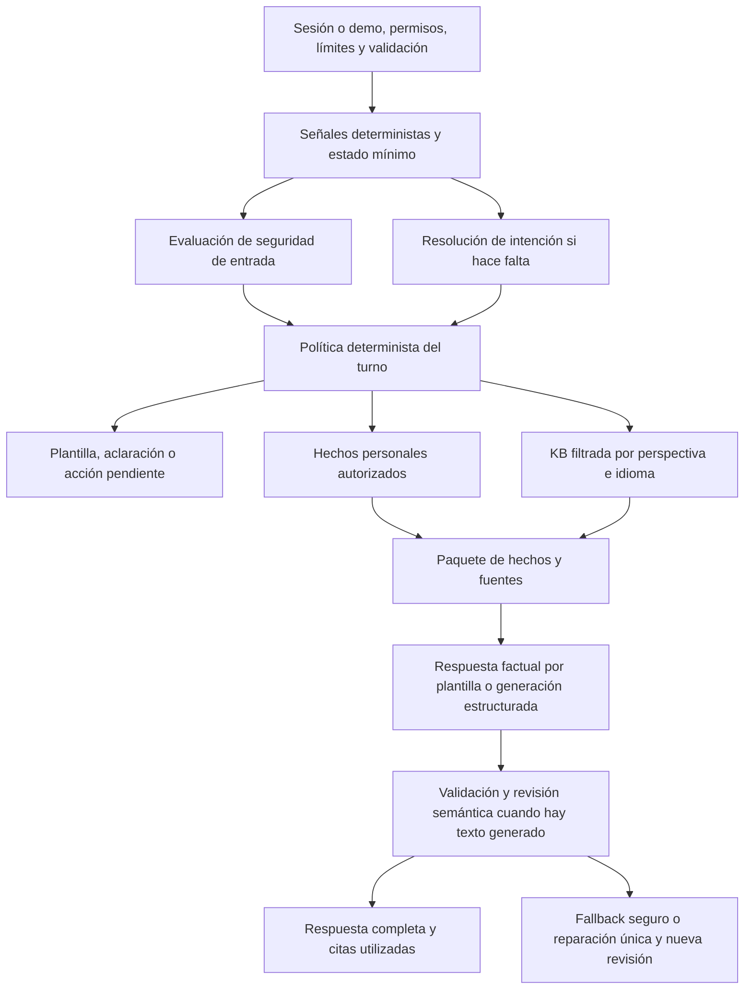

# Contornos y orquestación conversacional de VitaMap

Revisión: 2026-09-20 · Nota de avance: 2026-09-21. Estado: **arquitectura propuesta; base de separación y acceso experimental implementada, sin Jev activo ni ADR de adopción aceptada**.

Reevalúa `local-notes/ideas-entorno/02-comparativa-y-prioridades.md` contra el
código actual. La arquitectura objetivo se juzga independientemente del tamaño
del piloto. El orden de entrega sí contempla riesgo y dependencias.

## 1. Decisión propuesta

Conservar la custodia self-hosted, la memoria portable, QMD y los contratos
editoriales. Extraer del endpoint un orquestador con **decisiones tipadas,
herramientas deterministas, generación acotada y verificación independiente**.
La política del servidor decide qué datos leer y qué mostrar; ningún modelo
concede permisos ni convierte una conversación en memoria por iniciativa propia.

Adoptar el patrón de decisiones atómicas que propone TypeSafe. Evaluar Jev como
adaptador opcional con datos sintéticos; no convertirlo en dependencia obligatoria
ni reemplazar de entrada el detector de crisis o el guardrail. Primero eliminar
trabajo innecesario con las piezas existentes y medir el resultado.

## 2. Los momentos que constituyen la arquitectura

La filosofía aparece en las transiciones entre capas, no solo en el prompt.

| Momento | Invariante del producto | Consecuencia técnica |
|---|---|---|
| Una persona abre su memoria | Custodia, pertenencia y control | Resolver actor, sujeto y permisos antes de cualquier lectura; exportación, borrado y revocación abarcan también índices y cachés |
| Un documento se convierte en dato | La extracción es una propuesta | Conservar original, procedencia, fecha, unidad y correcciones; solo incorporar lo aprobado |
| Una persona pregunta | Prioridad estable, foco adaptable | Separar intención operativa de perspectiva editorial; una pregunta general no abre automáticamente la memoria personal |
| Se selecciona qué recordar | Conversar no equivale a registrar | Estado efímero del turno; propuesta de memoria separada, editable y con aprobación explícita |
| Se relacionan resultados | Medición antes que interpretación | Calcular desde observaciones verificables; mostrar límites de comparabilidad y distinguir última analítica de último valor de un marcador |
| La evidencia se vuelve explicación | Educación y conversación progresiva | Fuentes por afirmación, profundidad adaptada, sin diagnóstico ni tratamiento; preguntar solo cuando resuelva una ambigüedad útil |
| Cambia la perspectiva | Tradición con autonomía y límites | Biomedicina por defecto; tradición a petición; comparación en carriles separados, sin equivalencias automáticas |
| La respuesta llega a la persona | Seguridad y honestidad | Verificar la respuesta completa, reconocer insuficiencia y fallo de infraestructura; nunca confundir incertidumbre con permiso |

Esta lectura se apoya en [arquitectura del corpus §1.1](ARQUITECTURA-CORPUS-TEMATICO-Y-RECUPERACION.md),
[contornos Ayurveda](CONTORNOS-AYURVEDA-Y-ANALITICA.md),
[roadmap: consentimiento diferido](ROADMAP.md) y `SOCRATIC_SYSTEM_PROMPT` en
`apps/web/lib/llm.ts`. La ruta de visión citada por el README,
`docs/vision/VitaMap-Descripcion.txt`, no está en este checkout: no se ha tratado
como evidencia. Los flujos futuros del roadmap no se presuponen implementados.

## 3. Diagnóstico comprobado en código

Referencias de esta revisión: `apps/web/app/api/chat/route.ts` y módulos bajo
`apps/web/lib/`. Se revisó el árbol de trabajo, que contiene cambios previos;
esto no acredita la configuración ni el comportamiento del VPS.

### 3.1 Cuántas llamadas hay realmente

| Camino completado | Invocaciones a `chat()` |
|---|---:|
| Crisis detectada | 1, seguida de plantilla |
| Primer turno ordinario | 3: crisis, generación, guardrail |
| Turno ordinario con historial no vacío | 4: las anteriores + query rewrite |
| Reparación generativa | +1 o +2 |
| Recuperación determinista de analíticas tras `rewrite` | +0 |

Por tanto, **3–6 invocaciones**, según el camino, es más preciso que «4–5 por
mensaje». Son llamadas de aplicación, no una medida de tokens, latencia o trabajo
interno de QMD. Errores y salidas anticipadas pueden reducirlas.

`query-rewrite.ts` omite el LLM cuando no hay historial; con historial lo consulta
incluso si la nueva pregunta es autónoma. La búsqueda personal y la KB ya corren
en paralelo en `queryMemoryAndKB`; el encadenamiento costoso es el de las etapas.
El código de recuperación inspeccionado usa `rerank: false`: la capacidad de QMD
no debe confundirse con un reranker activo.

### 3.2 Qué existe y qué falta

- `conversation-policy.ts` distingue intenciones de recuperación;
  `marker-scope.ts` delimita tema y perspectiva; `personal-context-policy.ts`
  reconoce peticiones personales y temporales. **Falta un enrutador global**, no
  toda noción de intención. No duplicar estas taxonomías en un clasificador nuevo.
- El endpoint consulta ambos índices antes de filtrar parte del contexto personal.
  Filtrar después no evita ni el acceso innecesario ni su coste.
- `getLabSeriesSet`, `lab-visualization.ts` y `lab-chat-fallback.ts` ya construyen
  series y texto factual. El chat los usa como rescate o visualización, después
  de generar; deberían preparar las respuestas numéricas desde el inicio.
- `LabSeries` contiene puntos, comparabilidad y advertencias. No ofrece por sí
  mismo un motor validado de pendientes, conversiones o causalidad. Añadir esos
  cálculos sería trabajo nuevo, no solo cableado.
- `llm.ts` ya admite `jsonSchema`, usado por crisis y guardrail. Falta el contrato
  estructurado de la respuesta principal y su vínculo entre afirmaciones y fuentes.
- Las citas finales enumeran material recuperado: no prueban qué afirmación lo
  utilizó ni si la fuente realmente la sostiene.
- `checkResponse` es una pasada separada, pero usa el mismo cliente/modelo que
  genera. Independencia de etapa no equivale a independencia de errores.
- Tras una reescritura se aplican comprobaciones deterministas, sin repetir toda
  la revisión semántica. Un texto reescrito también puede introducir un fallo.
- Crisis tiene fail-open ante excepciones; una salida sin JSON activa crisis,
  pero un JSON mal formado puede caer en el `catch` de infraestructura. Separar
  error de transporte, formato inválido y resultado incierto.
- El detector limita cada mensaje a 500 caracteres, frente a 4000 admitidos por
  la ruta; puede perder una señal al final. El límite del historial también debe
  ser explícito y evaluado. No extrapolar cobertura a toda la conversación.
- Hay tiempos por algunas etapas y cuota por consulta, pero faltan consumo real
  por llamada, presupuesto acumulado y versiones. Crisis y rewrite no reciben el
  `deadline` de la ruta; tienen timeouts propios y cancelación incompleta.

## 4. Engranaje propuesto



### 4.1 Contratos y autoridad

Tipos orientativos; deberán concretarse con Zod y límites de tamaño. No son una
API existente:

```ts
type Intent =
  | 'knowledge' | 'personal_facts' | 'personal_explanation'
  | 'reflection' | 'action' | 'smalltalk' | 'mixed' | 'unclear';
type Perspective = 'biomedical' | 'traditional' | 'comparison';
type Safety = 'clear' | 'concern' | 'uncertain' | 'unavailable';
interface TurnAssessment {
  intent: Intent;
  perspective: Perspective;
  safety: Safety;
  needsClarification: boolean;
  // Ausente si el adaptador no ofrece una distribución utilizable.
  confidence?: number;
}
interface TurnPlan {
  route: Intent;
  readPersonal: boolean;
  readKB: boolean;
  render: 'template' | 'generated' | 'clarification' | 'pending_action';
  maxModelCalls: number;
  deadlineAt: number;
}
```

`TurnAssessment` es evidencia falible. `TurnPlan` lo construye código del servidor
combinando esa evidencia, los permisos reales, las reglas y el presupuesto.
`subjectId`, scopes, consentimiento y autorización de proveedor nunca proceden
del modelo, del historial enviado por el cliente ni de instrucciones del corpus.
Las fuentes son datos no confiables como instrucciones; una tarjeta no puede
activar una herramienta o cambiar la ruta.

Separar **ruta** de **perspectiva**: «qué es shukra» es conocimiento tradicional;
«muestra mi ferritina» es dato personal biomédico. Mantener `deriveScope` para
marcadores/áreas y los niveles `discover/understand/deep` para la presentación.
No promover conceptos tradicionales a biomarcadores desde el router.

El estado efímero conserva tema confirmado, marcadores seleccionados, ventana
temporal y oferta anterior del asistente. Ante «sí», resolver esa oferta; no
clasificarlo automáticamente como charla social. Ante cambio explícito de tema,
limpiar referentes anteriores. Dos referentes plausibles → pregunta aclaratoria.
Un estado enviado por el cliente se valida y nunca autoriza lecturas o escrituras.

### 4.2 Seguridad de entrada y selección de ruta

Mantener evaluación de seguridad de entrada para texto libre, incluso saludos y
hits de caché. Las reglas pueden elevar una señal de riesgo, pero su silencio no
prueba ausencia de riesgo. Intención clara por reglas → ninguna llamada adicional
de enrutamiento. Intención incierta → un evaluador acotado con abstención.

Inicialmente conservar el detector actual mientras se corrigen su cobertura,
parsing y cancelación. La evaluación de intención puede correr en paralelo con
él, sin acceder aún a memoria ni generar. Si el backend local serializa peticiones,
medir si ese paralelo aporta algo; no prometer una mejora de latencia.

Política propuesta, distinta del fail-open actual: `concern` → recursos fijos;
`uncertain` → respuesta cauta sin interpretación personal; `unavailable` → informar
fallo de verificación y ofrecer navegación/ayuda estática, sin declarar crisis ni
emitir una respuesta clínica generada. La disponibilidad no se disfraza de juicio
sobre la persona. Este cambio necesita pruebas específicas y un ADR antes de
activarse. Usar contexto acotado sin truncamiento silencioso; si excede cobertura,
marcarlo y degradar. Los recursos dependen del país configurado, no solo del idioma.

### 4.3 Tabla operativa y presupuesto

`S` = seguridad de entrada; `D` = decisión de intención solo si es ambigua;
`G` = generación; `V` = revisión semántica completa. Cada letra cuenta una
invocación al modelo. La tabla conserva S separada para no anticipar una sustitución
no evaluada. Las plantillas revisadas no requieren V en cada turno.

| Ruta | Contexto permitido | Salida | Coste ordinario objetivo |
|---|---|---|---|
| `smalltalk` claro | Estado mínimo, sin índices | Plantilla localizada | S = 1 |
| `personal_facts` | Observaciones autorizadas, sin KB por defecto | Tabla/texto/gráfica deterministas | S = 1; +D si ambiguo |
| `knowledge` | Solo KB pertinente | Generación fundamentada | S+G+V = 3; +D si ambiguo |
| `personal_explanation` / `mixed` | Hechos seleccionados + KB | Generación fundamentada | S+G+V = 3; +D si ambiguo |
| `reflection` | Turno y contexto conversacional mínimo | Acompañamiento sin registro automático | S+G+V = 3; +D si ambiguo |
| `action` | Descriptor de acción, sin escritura implícita | UI de revisión/confirmación | S = 1; +D si ambiguo |
| `unclear` | Estado mínimo | Aclaración por plantilla | S+D ≤ 2 |
| Hit de caché pública elegible | Entrada evaluada + contenido público validado | Respuesta cacheada | S = 1; +D si ambiguo |

En una evolución validada, un único evaluador podría devolver seguridad e
intención en preguntas independientes: `S+D` pasaría a una llamada. **No es requisito
para obtener la primera mejora.** Jev contaría como inferencia aunque no sea una
llamada a `chat()`. No anunciar «cero IA» para las rutas factuales: cero generación
no es cero clasificación.

Topes propuestos: 4 llamadas ordinarias; excepcionalmente hasta 6 si hay una
reparación + su revisión. Reparar una sola vez y solo si queda presupuesto; si
falla, usar fallback. No añadir una reescritura de búsqueda sistemática: primero
resolver referencias desde el estado; si no se puede, aclarar. Una futura
reescritura opcional debe consumir el mismo tope, nunca esconder llamadas.

Un deadline global, sublímites por etapa, cancelación propagada y contador común
incluyen reintentos del transporte. El adaptador no reintenta fuera del presupuesto.
La cuota visible sigue contando turnos (ADR-019); el gasto interno cuenta llamadas
y tokens. Fijar tiempos por backend tras medir p50/p95: todavía no hay SLO validado.

### 4.4 Hechos primero y fuentes después

Introducir `lab-facts.ts` sobre `getLabSeriesSet`, reutilizado por chat y mapa.
El paquete mínimo incluye IDs de observación y fuente, fecha, valor original,
unidad original, intervalo del informe, normalización y comparabilidad.

- «Última analítica»: seleccionar un informe por fecha e identidad, incluidos
  empates y paneles parciales. No componer un informe con el último valor de cada
  marcador tomado de fechas distintas. «Último valor de ferritina» es otra consulta.
- Sin unidad, fecha o rango verificables: campo desconocido y límite explícito.
  Un resultado censurado (`<`, `>`) no se trata como valor exacto para deltas.
- Delta solo con par comparable, fechas y regla de unidades validada; porcentaje
  indefinido con base cero. Dos puntos permiten una diferencia, no una tendencia
  clínica. Pendiente y baseline personal quedan para una ampliación evaluada.
- El intervalo del informe no es objetivo terapéutico, y estar dentro no demuestra
  salud. El generador no decide equivalencias ni calcula conversiones.
- La lectura factual no necesita esperar a LOINC, FHIR o una nueva base de datos.
  La proyección `observation` es una mejora posterior de consulta y consistencia.

Crear una recuperación pública que conserve los filtros de `queryMemoryAndKB` sin
abrir el índice personal. `queryKB` existe, pero no reproduce hoy toda esa política:
extraer lógica común y probar paridad de marcador, lens, sección e idioma antes de
reutilizarlo. Para notas personales, búsqueda separada bajo el sujeto autorizado;
para analíticas exactas, selección estructurada primero.

### 4.5 Generación y verificación

Contrato de respuesta propuesto:

```ts
interface AnswerBlock {
  kind: 'fact' | 'explanation' | 'reflection' | 'question' | 'caution';
  text: string;
  factIds: string[];
  sourceIds: string[];
  perspective: Perspective;
}
interface AnswerEnvelope {
  blocks: AnswerBlock[];
  suggestedFollowups: string[];
}
```

El servidor asigna IDs opacos del turno a hechos y fuentes y genera las URLs/citas;
el modelo no inventa rutas de archivos. Validar JSON, límites, IDs existentes,
permisos, campos obligatorios y correspondencia numérica. Para números personales,
preferir bloques renderizados directamente desde hechos y evitar que el modelo
reproduzca magnitudes libremente.

**Fuente existente no implica afirmación respaldada.** Mantener revisión semántica
de atribución, diagnóstico, prescripción y mezcla de perspectivas sobre toda
respuesta generada. Reflexiones o preguntas sin afirmaciones factuales no requieren
citas artificiales. Una reescritura debe pasar de nuevo todas las validaciones y V;
si no queda tiempo, fallback factual o aviso breve. Mostrar solo citas utilizadas,
con procedencia, fecha y nivel editorial desde metadatos del servidor.

Mantener entrega completa conforme a ADR-010. Validar párrafos aislados no evita
contradicciones posteriores y no permite retirar lo ya leído. Si interesa mejorar
la espera, mostrar estados de progreso sin contenido clínico. Streaming semántico
queda para una decisión independiente, con evaluación del conjunto.

### 4.6 Memoria, caché y telemetría

La intención `action` solo prepara una acción permitida. Para guardar conversación:
borrador efímero → revisión → aprobación explícita → escritura autorizada. Un «sí»
sin acción concreta pendiente no constituye consentimiento para persistir.

Primera caché: exacta, solo conocimiento público, revisado y sin dependencia del
historial personal. Clave: consulta pública normalizada + idioma + profundidad +
perspectiva + versiones de corpus, modelo, prompt, esquema y política. No basta
cachear por hash de una query reescrita. Excluir consultas con datos personales;
un hash tampoco anonimiza consultas sensibles. No registrar claves/consultas en
telemetría. Republicación o revocación de fuentes invalida las entradas. No guardar
crisis, errores, borradores ni respuestas personales en caché compartida.

Caché semántica después, solo si un banco de negaciones, temporalidad, intención y
perspectiva demuestra equivalencia; similitud vectorial no es equivalencia.

Medir ruta, tiempos, llamadas, tokens, resultado, fallbacks y versiones sin cuerpos,
fragmentos, valores clínicos ni marcadores personales. Métricas agregadas separadas
del audit log autorizado. Un sello de versiones da trazabilidad, no reproducibilidad
exacta si no se conserva el contexto; no justificar con él guardar conversaciones
sin permiso. Auditar redacción de errores además de logs normales.

## 5. TypeSafe/Jev: encaje y límites

Desarrollo acotado de esta variante: [Plan de implementación Jev](PLAN-VARIANTE-JEV.md). Amplía el ensayo a pertinencia de evidencia y respaldo de afirmaciones, con presupuesto propio de 5–6 llamadas en explicaciones completas y adopción por componente. No presupone ahorro universal ni sustituye seguridad de entrada.

Según su [introducción](https://docs.typesafe.ai/introduction), Jev evalúa preguntas
tipadas sobre un estado; permite combinar Choice, Score y Noul en una petición.
La evaluación independiente de preguntas favorece separar juicios y componer la
política en código. Es un patrón pertinente para VitaMap; las afirmaciones de
rapidez del proveedor no son resultados medidos en este proyecto.

La [documentación de confianza](https://docs.typesafe.ai/confidence) distingue la
distribución de opciones de su resumen `confidence`. Choice y Score lo incluyen;
Noul no. Esa confianza no debe interpretarse como probabilidad de corrección
clínica ni trasladarse sin calibración a español, alemán y conversaciones ambiguas.

La [API](https://docs.typesafe.ai/api) recibe `state`, `model` y `questions` por HTTP
y devuelve respuestas, modelo y uso. Se puede implementar un adaptador TypeScript
con `fetch`, validación Zod, timeout y reintentos acotados; no exige añadir Python.
Validar también claves esperadas, enums, rangos y suma de probabilidades. Registrar
la versión efectivamente devuelta y evitar alias móviles en comparaciones.

El patrón de [enrutamiento](https://docs.typesafe.ai/patterns/intent-routing) encaja
con handlers de distinto coste. Propuesta de ensayo propia para VitaMap:

| Pregunta atómica | Uso experimental | Lo que no autoriza |
|---|---|---|
| Choice: intención operativa, incluyendo `unclear` y `mixed` | Elegir candidato de ruta | Abrir memoria o ejecutar acciones |
| Choice: perspectiva solicitada | Separar biomedicina/tradición/comparación | Transferir evidencia entre planos |
| Choice: dependencia del turno anterior | Ayudar a decidir si aclarar | Inventar el referente o reescribir texto |
| Noul: presencia de una afirmación no sustentada, con texto y fuentes | Evaluador en pruebas offline | Aprobar una respuesta clínica por un umbral arbitrario |

No usar Score para inferir «gravedad clínica». No combinar en una petición inicial
la intención y la verificación de una respuesta aún inexistente: son etapas con
estados diferentes. Solo después de validar por separado seguridad e intención
considerar evaluarlas juntas; el fallo común de proveedor debe tener salida segura.

**Alternativas a comparar:** reglas actuales consolidadas; reglas + JSON Schema
con el proveedor ya configurado; adaptador Jev. Comparar mismo corpus sintético,
idiomas, presupuesto y cobertura, incluyendo abstención, caída, 429 y sobrecarga.
No inventar confianza numérica para reglas ni para un LLM que solo la autodeclara.

La [página de modelos](https://docs.typesafe.ai/models), consultada también el
2026-09-20, declara que no se entrena con solicitudes ni respuestas y remite a
condiciones de ZDR empresarial. Esa información no basta para acreditar residencia
UE, retención aplicable a nuestra cuenta, subencargados, DPA firmado, despliegue
local o SLA de TypeSafe. Quedan por
verificar documentalmente antes de enviar datos de salud, también si se trata solo
de una pregunta al router. Eliminar nombres no anonimiza síntomas o analíticas.
El consentimiento existente para otro proveedor no habilita automáticamente este.
Hasta resolverlo, ensayo exclusivamente sintético; el flujo normal no depende de Jev.

**Criterio de adopción:** mejora medida de precisión/cobertura o p95/coste sin
regresión en casos críticos y con condiciones de datos compatibles. Si no aporta
ventaja, conservar el contrato y el adaptador existente. Esta revisión consultó
documentación pública; no ejecutó peticiones de inferencia ni verificó latencia,
precio o disponibilidad comercial de Jev.

## 6. Ajustes a las otras propuestas de arquitectura

| Propuesta inicial | Ajuste necesario |
|---|---|
| DEK ligada al usuario hace irrelevante LUKS y protege de root | Definir amenaza. Root durante sesión puede leer memoria o modificar el proceso. Proteger volumen, derivados, temporales y backups sigue siendo necesario; no prometer zero-knowledge con inferencia en servidor |
| Passkeys y cifrado en una migración simple | Separar autenticación, disponibilidad de PRF, recuperación, múltiples dispositivos, sesiones concurrentes y cifrado compatible con QMD/SQLite. Requiere diseño y prueba de restauración antes de migrar |
| Redactar datos antes de `userContent` | Cubrir **todas** las salidas: crisis, rewrite, generación, guardrail, extracción y futuros adaptadores. Minimización central por finalidad/proveedor; no equivaler redacción a anonimización |
| Guardrail pequeño entrenado con audit log | El audit no conserva conversaciones; no sirve como corpus textual. Construir casos sintéticos y ejemplos aportados con permiso, revisados y separados del test |
| `observation` + LOINC como prerrequisito del agente | Empezar con hechos existentes; proyección reconstruible después. LOINC depende de muestra, método y propiedad, no solo del nombre del marcador |
| Conversión universal a SI | Tabla explícita por analito y condiciones, validada; conservar originales. No convertir si faltan contexto o equivalencia |
| FHIR entendido por cualquier sistema/ePA | Exportación con perfil objetivo y validación; interoperabilidad real requiere adaptador y pruebas con el receptor, no solo un Bundle |
| Markdown e índice como escritura indivisible | Fuente canónica + revisión + cola durable/reconciliación. Leer hechos aprobados recientes desde la fuente aunque QMD esté atrasado; indicar degradación de búsqueda, no esconder datos válidos |
| Baseline personal como siguiente visual | Banda descriptiva con tamaño muestral y límites; no presentarla como normalidad o objetivo. No priorizarla antes de garantizar comparabilidad |

Las prioridades de custodia y consentimiento siguen abiertas con independencia
del agente. El rediseño conversacional no declara cerrado ningún requisito del
piloto ni sustituye su expediente de proveedores.

## 7. Mapa de implementación por entregas verificables

Rutas nuevas son propuestas bajo `apps/web/`. Cada entrega debe poder revisarse y
revertirse sin migraciones destructivas. Roles sugeridos, no personas asignadas.

| Entrega / dependencia | Trabajo concreto | Criterio de aceptación |
|---|---|---|
| **E0 · base** | Backend: instrumentar `lib/llm.ts` preservando `chat(): Promise<string>`; medir uso/etapa/cancelación. Evaluación: banco sintético de turnos completos ES/DE | Baseline por ruta de llamadas, p50/p95, fallos y tokens; inspección de logs sin contenido sensible |
| **E1 · E0** | Backend: `lib/turn-policy.ts`, `lib/intent-router.ts`, `lib/turn-budget.ts`; extraer orquestación de `app/api/chat/route.ts`. Corregir cobertura/error/abort de `crisis.ts` | Plan tipado, topes comprobados; intención incierta aclara; caída de seguridad no genera; auth/demo/cuotas conservadas |
| **E2 · E1** | Backend: `lib/lab-facts.ts`; reutilizar `memory-reader.ts` y `lab-chat-fallback.ts`; extracción común de filtros en `qmd.ts` | Ruta factual sin generación, cifras idénticas entre chat y gráfica; knowledge no abre user store; última analítica no mezcla informes |
| **E3 · E2** | Backend + UI: `lib/answer-contract.ts`, `lib/answer-validator.ts`; usar JSON Schema; adaptar componente de chat; revisión de reparación | IDs/citas válidos; ninguna salida generada sin V; una reparación máxima; fallback mantiene API/UI legibles |
| **E4 · E0, E1** | Evaluación: interfaz `DecisionEvaluator` y `lib/decision-evaluators/typesafe.ts` experimental; configuración validada | Comparación offline ciega con alternativas; sin datos reales ni tráfico espejo de producción; informe de decisión adoptar/descartar |
| **E5 · E2, E3** | Backend: caché pública exacta, invalidación y versiones; CI de invariantes | Sin entradas personales; publicación invalida; seguridad de entrada también en hit; reducción medida y sin regresión |
| **E6 · independiente de E4/E5** | Datos + seguridad: proyección `observation`, correcciones versionadas, reconstrucción y reconciliación | Conteos/hashes contra memoria canónica; recuperación tras fallo entre escritura e índice; borrado/exportación cubren derivados |

E4 puede prepararse mientras avanza E2, pero no bloquea ninguna mejora. LOINC,
conversiones, FHIR, cifrado con claves de usuario y streaming merecen entregas y
ADRs propios. No introducirlos juntos en el refactor del chat.

### 7.1 Banco de aceptación

Las suites `eval/*.yml` actuales evalúan recuperación; `eval:validate` comprueba
referencias de tarjetas. Ninguna de las dos demuestra por sí sola seguridad de
respuesta o calidad del router. Añadir un banco de turnos con ruta esperada,
lecturas permitidas, hechos, perspectiva, abstención y presupuesto esperado.

| Familia | Casos mínimos y resultado requerido |
|---|---|
| Intención y memoria | «qué es HbA1c» sin lectura personal; «y la mía» resuelve sujeto/tema o aclara; «sí» recupera oferta; cambio de tema limpia contexto |
| Hechos | Fechas desordenadas, dos informes el mismo día, panel incompleto, unidad ausente/distinta, resultados censurados y corrección; no inventar comparabilidad |
| Figura/fondo | Shukra desde sus fuentes; eficacia desde evidencia; comparación separada; cero equivalencias biomédicas implícitas |
| Seguridad | Señal indirecta, negación, cita académica, señal después del carácter 500; timeout/JSON inválido distinguidos de ausencia de riesgo |
| Ataques y permisos | Instrucción maliciosa en tarjeta/historial; sujeto falsificado; grant revocado; demo solo sintética; acción sin confirmación nunca escribe |
| Salida | Fuente inventada, fuente real que no respalda el texto, número cambiado, reescritura dañina y salida vacía: rechazo o fallback |
| Caché y fallos | Negaciones no colisionan; corpus actualizado invalida; cero fuga entre sujetos; abort, 429 y proveedor caído respetan presupuesto |

Usar spies/fakes de lectores y modelos para probar ausencia de accesos y conteo
exacto; ejecutar evaluación real por separado con contenido sintético. Reutilizar
`test:conversation-policy`, `test:personal-context-policy`, `test:marker-scope`,
`test:lab-visualization`, `test:lab-chat-fallback`, `test:lab-response-policy`,
`test:crisis`, `test:data-access`, `check:data-access`, `test:demo` y
`test:llm-quota`, además de typecheck y suites de idioma/editorial afectadas.

Puertas propuestas: cero violaciones en aislamiento, escrituras no autorizadas,
hechos numéricos y casos críticos fijados; ninguna regresión `must_not_prioritize`;
reportar precisión, abstención y falsos negativos por idioma con tamaño del banco.
Cero fallos observados no garantiza seguridad universal. Umbrales probabilísticos
se ajustan en validación y se congelan antes del test reservado. Objetivo inicial
de rendimiento: al menos una llamada menos en seguimientos claros y eliminar
G/V de consultas puramente factuales; comprobar p95 en el backend real antes de
anunciar segundos o porcentajes de ahorro.

### 7.2 Activación y reversión

Proponer `CHAT_ORCHESTRATOR_V2=false` y
`TURN_DECISION_PROVIDER=existing|typesafe` (default `existing`), aún inexistentes.
Validarlos en `env.ts` e incluir ejemplos al implementarlos. Primero tests offline,
después demo sintética, luego cohorte acotada bajo el expediente vigente. No usar
shadow mode con datos reales hacia un proveedor nuevo no habilitado.

La reversión desactiva el router nuevo sin cambiar memoria; invalida su caché y
mantiene correcciones de seguridad independientes. No regresar automáticamente
al fail-open antiguo por una caída de Jev: usar reglas/clarificación y la política
de seguridad aprobada. Toda futura proyección debe ser reconstruible antes de
usarse para decisiones. Guardar la decisión final de adopción en un ADR nuevo sin
reescribir el historial de `DECISIONS.md`.

## 8. Alcance de esta revisión

La revisión inicial contrastó documentos y código y definió módulos, dependencias
y criterios. El 2026-09-21 se extrajo el motor actual y se incorporó una puerta de
selección experimental exclusiva de admin, apagada por defecto. El detalle de
lo implementado y lo pendiente está en [la estrategia de convivencia §9](PLAN-VARIANTE-JEV.md#9-estrategia-de-convivencia-y-pruebas-por-administrador).
No se ha instalado TypeSafe, enviado datos personales a Jev, medido inferencia ni
ejecutado un despliegue. Los objetivos de llamadas futuros siguen siendo contratos
propuestos, no resultados medidos.
